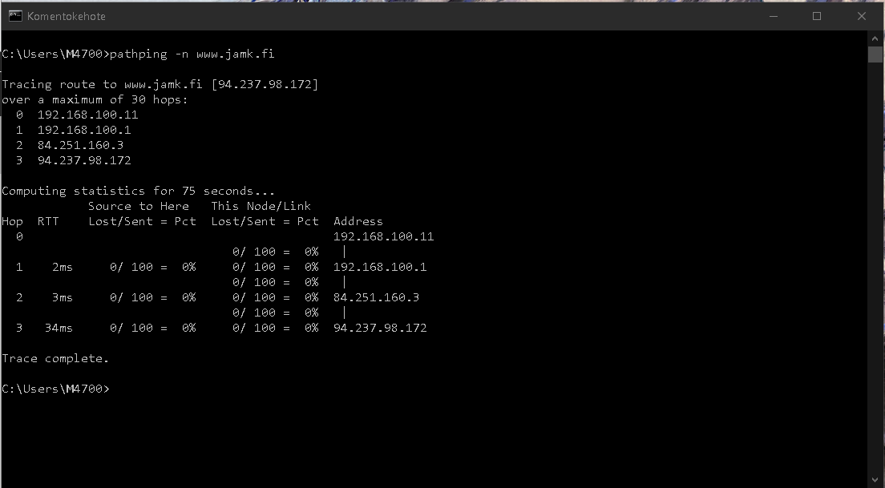

# Dokumentaatio tehtävään E01

Virtuaalikone mac : 080027BEAA4D

Kuvakaappaus:

 

<em>Mihin tätä virtuaalikonetta voi käyttää ilman verkkoyhteyttä? Mitä voit tehdä sillä?</em>
Vastaus: Tällä virtuaalikoneella voi testata mm. käyttöjärjestelmien päivityksiä, ohjelmien asentumista,
tietoturvaa ja muita ongelmatilanteita (esimerkiksi virushyökkäyssimulaatio, tiedostojen poisto, korruptoituminen), 
joiden testaaminen loppukäyttäjän laitteella voi olla epäkäytännöllistä(testaaminen hajottaa fyysisen komponentin) tai mahdotonta. 
Vahingot voidaan rajata vain kyseiseen virtuaalikoneeseen.

<em>Onko tietokoneilla mitään tarkoitusta ilman yhteyttä tietoverkkoon?</em>
Vastaus: Perusasioita voidaan suorittaa tietokoneilla ilman yhteyttä tietoverkkoon (Tekstinkäsittely, manuaalisesti asennettujen ohjemien
käyttö, ohjelmointia), mutta käytännössä on hankalaa olla nykypäivänä ilman yhteyttä, koska tiedon jakaminen tapahtuu verkon välityksellä.
(Sähköpostit, kommunikointi, uutisointi, tiedonhaku)

Luettuani Alan Turingista, voidaan tietokoneella suorittaa laskentoja ja ohjelmointia tai simuloida tosielämän ongelmia matemaattisilla algoritmeillä.

Kuvakaappaus:
<em>Käytä virtuaalikoneelta ping www.jamk.fi ja dokumentoi lopputulokset</em>
 

Käytä Traceroutea
<em>Tee traceroute www.jamk.fi ja dokumentoi tulokset.</em>
Kuvakaappaus:
 

<em>Tee myös traceroute --resolve-hostnames www.jamk.fi ja dokumentoi tulokset.</em>
Kuvakaappaus:
 

Virtuaalikoneella:
mtr
<em>Käytä komentoa mtr www.jamk.fi ja dokumentoi tulokset.</em>
Kuvakaappaus:
 
<em>Käytä komentoa mtr -n www.jamk.fi ja dokumentoi tulokset.</em>
Kuvakaappaus:
 

Emokoneella:
patchping
<em>Käytä komentoa pathping www.jamk.fi ja dokumentoi tulokset.</em>
Kuvakaappaus:
 
<em>Käytä komentoa pathping -n www.jamk.fi ja dokumentoi tulokset.</em>
Kuvakaappaus:
 
