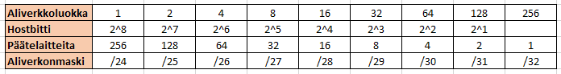
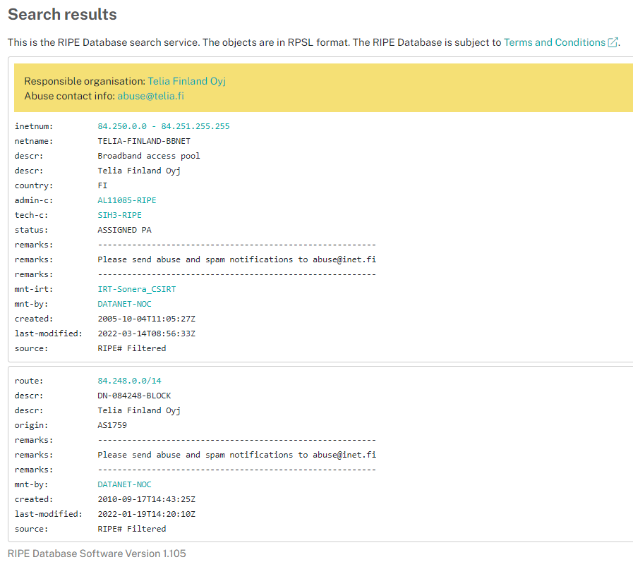
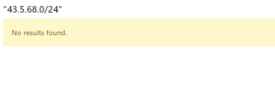
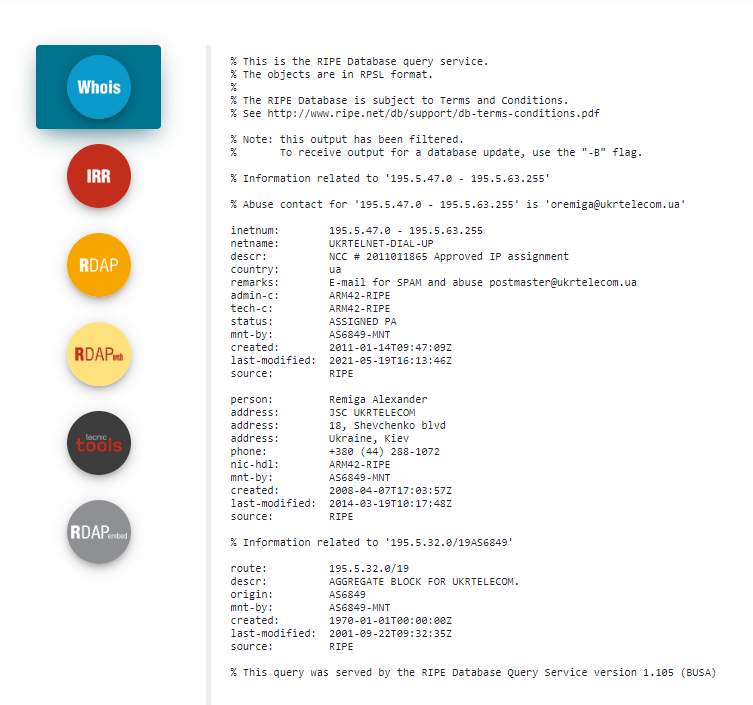

# Dokumentaatio tehtävään E03

2205268
vvxyzki

<em>Käytä opiskelijanumeroasi ja muodosta seuraavat aliverkot: 10.xy.yz.0/24 and 192.168.ki.0/24</em>

10.05.52.0/24

192.168.68.0/24

<h2>Harjoitus 1</h2>

<em>Mikä on 192.168.ki.0/24:n käytettävä osoiteavaruus (päätelaitteille)?</em>

--> Minkä kokoinen aliverkko?

--> Aliverkon maski määrittää verkon koon

/24			"släsh" formaatissa aliverkonmaski

				"binääri" muodossa/formaatissa aliverkonmaski (BIN)

11111111 . 11111111 . 11111111 . 00000000 <-- IPv4 32 bit osoite

nnnnnnnn . nnnnnnnn . nnnnnnnn . hhhhhhhh <-- n=network bit, h=host bit

				"decimal" muodossa/formaatissa aliverkonmaski (DEC, kokonaisluku)

255		. 255	   . 255	  . 0

 host biteille jää:

BIN				->	DEC

hhhh hhhh		->	2^h = 2^8 = 256

0000 0000		->	0				!!! VERKONOSOITE !!!

0000 0001		->	1

0000 0010		->	2

0000 0011		->	3

0000 0100		->	4

0000 0101		->	5

0000 0110		->	6

0000 0111		->	7

0000 1000		->	8

...

1111 1100		->	252

1111 1101		->	253

1111 1110		->	254

1111 1111		->	255				!!! YLEISLÄHETYSOSOITE !!! (eng. broadcast address)

Osoiteavaruutta 192.168.68.0/24 -aliverkossa on  
192.168.68.0 - 192.168.68.255 välillä 
 
IPv4:ssa EI saa käyttää työasemille verkonosoitetta tai yleislähetysosoitetta. 
--> työasemat/päätelaitteet voivat käyttää 192.168.68.1 - 192.168.68.254

<em>Mikä on kyseisen verkon yleislähetysosoite? (eng. Broadcast address)</em>

192.168.68.255 <<--- IMPORTANT!! Yleislähetysosoite on osoite, jossa kaikki host bitit ovat ykkösiä (255)

<em>Mikä on verkon osoite? (eng. Subnet Address)</em>

!! Verkon osoite on osoite, jossa host bitit ovat kaikki nollia

192.168.68.0

<h2>Harjoitus 2</h2>
<em>Jaa 192.168.68.0/24 pienemmiksi aliverkoiksi, johon mahtuu vähintään 50 päätelaitetta.</em>
<em>Huom! Tee mahdollisimman pieni aliverkko!</em>

2^h = 2^8 = 256 

2^h = 50 
2^4 = 16 
2^5 = 32 
2^6 = 64		<-- Tähän mahtuisi 50 päätelaitetta!!!

--> Minkä kokoinen aliverkko?

--> Aliverkon maski määrittää verkon koon

/26			"släsh" formaatissa aliverkonmaski

				"binääri" muodossa/formaatissa aliverkonmaski (BIN)

11111111 . 11111111 . 11111111 . 11000000 <-- IPv4 32 bit osoite

nnnnnnnn . nnnnnnnn . nnnnnnnn . nnhhhhhh <-- n=network bit, h=host bit

				"decimal" muodossa/formaatissa aliverkonmaski (DEC, kokonaisluku)

255		. 255	   . 255	  . 192

host biteille jää:

BIN			->	DEC

nn | hh hhhh		->	2^h = 2^6 = 64

00 | 00 0000		->	192.168.68.0				!!! VERKONOSOITE !!!

00 | 00 0001		->	192.168.68.1

00 | 00 0010		->	192.168.68.2

00 | 00 0011		->	192.168.68.3

00 | 00 0100		->	192.168.68.4

00 | 00 0101		->	192.168.68.5

00 | 00 0110		->	192.168.68.6

00 | 00 0111		->	192.168.68.7

00 | 00 1000		->	192.168.68.8

...

00 | 11 1100		->	192.168.68.60

00 | 11 1101		->	192.168.68.61

00 | 11 1110		->	192.168.68.62

00 | 11 1111		->	192.168.68.63			!!! YLEISLÄHETYSOSOITE !!! (eng. broadcast address)

------------------------------ #2 ALIVERKON RAJA ------------------------------------ 2^n = 2^2 = 4
192.168.68.64 - 192.168.68.127

nn | hh hhhh

01 | 00 0000		->	192.168.68.64				!!! VERKONOSOITE !!!

01 | 00 0001		->	192.168.68.65

01 | 00 0010		->	192.168.68.66

01 | 00 0011		->	192.168.68.67

01 | 00 0100		->	192.168.68.68

01 | 00 0101		->	192.168.68.69

01 | 00 0110		->	192.168.68.70

01 | 00 0111		->	192.168.68.71

01 | 00 1000		->	192.168.68.72

...

01 | 11 1100		->	192.168.68.124

01 | 11 1101		->	192.168.68.125

01 | 11 1110		->	192.168.68.126

01 | 11 1111		->	192.168.68.127			!!! YLEISLÄHETYSOSOITE !!! (eng. broadcast address)

------------------------------ #3 ALIVERKON RAJA ------------------------------------
192.168.68.128 - 192.168.68.191

nn | hh hhhh

10 | 00 0000		->	192.168.68.128				!!! VERKONOSOITE !!!

10 | 00 0001		->	192.168.68.129

10 | 00 0010		->	192.168.68.130

10 | 00 0011		->	192.168.68.131

10 | 00 0100		->	192.168.68.132

10 | 00 0101		->	192.168.68.133

10 | 00 0110		->	192.168.68.134

10 | 00 0111		->	192.168.68.135

10 | 00 1000		->	192.168.68.136

...

10 | 11 1100		->	192.168.68.188

10 | 11 1101		->	192.168.68.189

10 | 11 1110		->	192.168.68.190

10 | 11 1111		->	192.168.68.191			!!! YLEISLÄHETYSOSOITE !!! (eng. broadcast address)

------------------------------ #4 ALIVERKON RAJA ------------------------------------
192.168.69.192 - 1922.168.68.255

nn | hh hhhh

11 | 00 0000		->	192.168.68.192				!!! VERKONOSOITE !!!

11 | 00 0001		->	192.168.68.193

11 | 00 0010		->	192.168.68.194

11 | 00 0011		->	192.168.68.195

11 | 00 0100		->	192.168.68.196

11 | 00 0101		->	192.168.68.197

11 | 00 0110		->	192.168.68.198

11 | 00 0111		->	192.168.68.199

11 | 00 1000		->	192.168.68.200

...

11 | 11 1100		->	192.168.68.252

11 | 11 1101		->	192.168.68.253

11 | 11 1110		->	192.168.68.254

11 | 11 1111		->	192.168.68.255			!!! YLEISLÄHETYSOSOITE !!! (eng. broadcast address)

<em>Täytä Aliverkon tiedot sarake tiedoillasi. Jos verkkoja tulee useampia, lisää sarakkeita.</em>

 Alla kyseinen taulukko excelissä

<h2>Harjoitus 3</h2>
<em>Jaa 10.5.52.0/24 pienemmiksi aliverkoiksi, johon mahtuu vähintään 13 päätelaitetta. 
Huom! Tee mahdollisimman pieni(ä) aliverkko(ja):</em>

2^h = 13 
2^4 = 16<--- Tähän mahtuisi 13 päätelaitetta!!

--> Minkä kokoinen aliverkko?

--> Aliverkon maski määrittää verkon koon

/28			"släsh" formaatissa aliverkonmaski

				"binääri" muodossa/formaatissa aliverkonmaski (BIN)

11111111 . 11111111 . 11111111 . 11110000 <-- IPv4 32 bit osoite

nnnnnnnn . nnnnnnnn . nnnnnnnn . nnnnhhhh <-- n=network bit, h=host bit

				"decimal" muodossa/formaatissa aliverkonmaski (DEC, kokonaisluku)

255		. 255	   . 255	  . 240

host biteille jää:

BIN			->	DEC

nnnn | hhhh		->	2^h = 2^4 = 16

0000 | 0000		->	10. 5.52.0				!!! VERKONOSOITE !!!

0000 | 0001		->	10.5.52.1

0000 | 0010		->	10.5.52.2

0000 | 0011		->	10.5.52.3

0000 | 0100		->	10.5.52.4

0000 | 0101		->	10.5.52.5

0000 | 0110		->	10.5.52.6

0000 | 0111		->	10.5.52.7

0000 | 1000		->	10.5.52.8

...

0000 | 1100		->	10.5.52.12

0000 | 1101		->	10.5.52.13

0000 | 1110		->	10.5.52.14

0000 | 1111		->	10.5.52.15			!!! YLEISLÄHETYSOSOITE !!! (eng. broadcast address)

------------------------------ #2 ALIVERKON RAJA ------------------------------------2^n = 2^4 = 16
10.5.52.16 - 10.5.52.31

nnnn | hhhh

0001 | 0000		->	10.5.52.16				!!! VERKONOSOITE !!!

0001 | 0001		->	10.5.52.17

0001 | 0010		->	10.5.52.18

0001 | 0011		->	10.5.52.19

0001 | 0100		->	10.5.52.20

0001 | 0101		->	10.5.52.21

0001 | 0110		->	10.5.52.22

0001 | 0111		->	10.5.52.23

0001 | 1000		->	10.5.52.24

...

0001 | 1100		->	10.5.52.28

0001 | 1101		->	10.5.52.29

0001 | 1110		->	10.5.52.30

0001 | 1111		->	10.5.52.31			!!! YLEISLÄHETYSOSOITE !!! (eng. broadcast address)

------------------------------ #3 ALIVERKON RAJA ------------------------------------
10.5.52.32 - 10.5.52.47

nnnn | hhhh

0010 | 0000		->	10.5.52.32				!!! VERKONOSOITE !!!

0010 | 0001		->	10.5.52.33

0010 | 0010		->	10.5.52.34

0010 | 0011		->	10.5.52.35

...

0010 | 1100		->	10.5.52.44

0010 | 1101		->	10.5.52.45

0010 | 1110		->	10.5.52.46

0010 | 1111		->	10.5.52.47			!!! YLEISLÄHETYSOSOITE !!! (eng. broadcast address)

------------------------------ #4 ALIVERKON RAJA ------------------------------------
10.5.52.48 - 10.5.52.63

nnnn | hhhh

0011 | 0000		->	10.5.52.48				!!! VERKONOSOITE !!!

0011 | 0001		->	10.5.52.49

0011 | 0010		->	10.5.52.50

0011 | 0011		->	10.5.52.51

...

0011 | 1100		->	10.5.52.60

0011 | 1101		->	10.5.52.61

0011 | 1110		->	10.5.52.62

0011 | 1111		->	10.5.52.63			!!! YLEISLÄHETYSOSOITE !!! (eng. broadcast address)

------------------------------ #5 ALIVERKON RAJA ------------------------------------
10.5.52.64 - 10.5.52.79

nnnn | hhhh

0100 | 0000		->	10.5.52.64				!!! VERKONOSOITE !!!

0100 | 0001		->	10.5.52.65

0100 | 0010		->	10.5.52.66

0100 | 0011		->	10.5.52.67

...

0100 | 1100		->	10.5.52.76

0100 | 1101		->	10.5.52.77

0100 | 1110		->	10.5.52.78

0100 | 1111		->	10.5.52.79			!!! YLEISLÄHETYSOSOITE !!! (eng. broadcast address)

------------------------------ #6 ALIVERKON RAJA ------------------------------------
10.5.52.80 - 10.5.52.95

nnnn | hhhh

0101 | 0000		->	10.5.52.80				!!! VERKONOSOITE !!!

0101 | 0001		->	10.5.52.81

0101 | 0010		->	10.5.52.82

0101 | 0011		->	10.5.52.83

...

0101 | 1100		->	10.5.52.92

0101 | 1101		->	10.5.52.93

0101 | 1110		->	10.5.52.94

0101 | 1111		->	10.5.52.95			!!! YLEISLÄHETYSOSOITE !!! (eng. broadcast address)

------------------------------ #7 ALIVERKON RAJA ------------------------------------
10.5.52.96 - 10.5.52.111

nnnn | hhhh

0110 | 0000		->	10.5.52.96				!!! VERKONOSOITE !!!

0110 | 0001		->	10.5.52.97

0110 | 0010		->	10.5.52.98

0110 | 0011		->	10.5.52.99

...

0110 | 1100		->	10.5.52.108

0110 | 1101		->	10.5.52.109

0110 | 1110		->	10.5.52.110

0110 | 1111		->	10.5.52.111			!!! YLEISLÄHETYSOSOITE !!! (eng. broadcast address)

------------------------------ #8 ALIVERKON RAJA ------------------------------------
10.5.52.112 - 10.5.52.127

nnnn | hhhh

0111 | 0000		->	10.5.52.112				!!! VERKONOSOITE !!!

0111 | 0001		->	10.5.52.113

0111 | 0010		->	10.5.52.114

0111 | 0011		->	10.5.52.115

...

0111 | 1100		->	10.5.52.124

0111 | 1101		->	10.5.52.125

0111 | 1110		->	10.5.52.126

0111 | 1111		->	10.5.52.127			!!! YLEISLÄHETYSOSOITE !!! (eng. broadcast address)

------------------------------ #9 ALIVERKON RAJA ------------------------------------
10.5.52.128 - 10.5.52.143

nnnn | hhhh

1000 | 0000		->	10.5.52.128				!!! VERKONOSOITE !!!

1000 | 0001		->	10.5.52.129

1000 | 0010		->	10.5.52.130

1000 | 0011		->	10.5.52.131

...

1000 | 1100		->	10.5.52.140

1000 | 1101		->	10.5.52.141

1000 | 1110		->	10.5.52.142

1000 | 1111		->	10.5.52.143			!!! YLEISLÄHETYSOSOITE !!! (eng. broadcast address)

------------------------------ #10 ALIVERKON RAJA ------------------------------------
10.5.52.144 - 10.5.52.159

nnnn | hhhh

1001 | 0000		->	10.5.52.144				!!! VERKONOSOITE !!!

1001 | 0001		->	10.5.52.145

...

1001 | 1101		->	10.5.52.157

1001 | 1110		->	10.5.52.158

1001 | 1111		->	10.5.52.159			!!! YLEISLÄHETYSOSOITE !!! (eng. broadcast address)

------------------------------ #11 ALIVERKON RAJA ------------------------------------
10.5.52.160 - 10.5.52.175

nnnn | hhhh

1010 | 0000		->	10.5.52.160				!!! VERKONOSOITE !!!

1010 | 0001		->	10.5.52.161

...

1010 | 1101		->	10.5.52.173

1010 | 1110		->	10.5.52.174

1010 | 1111		->	10.5.52.175			!!! YLEISLÄHETYSOSOITE !!! (eng. broadcast address)

------------------------------ #12 ALIVERKON RAJA ------------------------------------
10.5.52.176 - 10.5.52.191

nnnn | hhhh

1011 | 0000		->	10.5.52.176				!!! VERKONOSOITE !!!

1011 | 0001		->	10.5.52.177

...

1011 | 1101		->	10.5.52.189

1011 | 1110		->	10.5.52.190

1011 | 1111		->	10.5.52.191			!!! YLEISLÄHETYSOSOITE !!! (eng. broadcast address)

------------------------------ #13 ALIVERKON RAJA ------------------------------------
10.5.52.192 - 10.5.52.207

nnnn | hhhh

1100 | 0000		->	10.5.52.192				!!! VERKONOSOITE !!!

1100 | 0001		->	10.5.52.193

...

1100 | 1101		->	10.5.52.205

1100 | 1110		->	10.5.52.206

1100 | 1111		->	10.5.52.207			!!! YLEISLÄHETYSOSOITE !!! (eng. broadcast address)

------------------------------ #14 ALIVERKON RAJA ------------------------------------
10.5.52.208 - 10.5.52.223

nnnn | hhhh

1101 | 0000		->	10.5.52.208				!!! VERKONOSOITE !!!

1101 | 0001		->	10.5.52.209

...

1101 | 1101		->	10.5.52.221

1101 | 1110		->	10.5.52.222

1101 | 1111		->	10.5.52.223			!!! YLEISLÄHETYSOSOITE !!! (eng. broadcast address)

------------------------------ #15 ALIVERKON RAJA ------------------------------------
10.5.52.224 - 10.5.52.239

nnnn | hhhh

1110 | 0000		->	10.5.52.224				!!! VERKONOSOITE !!!

1110 | 0001		->	10.5.52.225

...

1110 | 1101		->	10.5.52.237

1110 | 1110		->	10.5.52.238

1110 | 1111		->	10.5.52.239			!!! YLEISLÄHETYSOSOITE !!! (eng. broadcast address)

<em>Pohdintoja</em>

Nyt hoksasin, 2^n = x, <-- x kertoo, kuinka monta aliverkkoa muodostuu halutuille laitteille

Kuvakaappauksia taulukosta

<h2>Harjoitus 4</h2>
<em>Jaa viimeinen aliverkko harjoituksesta 3 pienemmiksi aliverkoiksi, johon mahtuu vähintään 2 päätelaitetta.  
Huom! Tee mahdollisimman pieni(ä) aliverkko(ja):</em>
10.5.52.240 - 10.5.52.255

2^h = 2 
2^2 = 4 - 2 = 2  <--- Tähän mahtuisi 2 päätelaitetta!!

--> Minkä kokoinen aliverkko?

--> Aliverkon maski määrittää verkon koon

/30			"släsh" formaatissa aliverkonmaski

				"binääri" muodossa/formaatissa aliverkonmaski (BIN)

11111111 . 11111111 . 11111111 . 11111100 <-- IPv4 32 bit osoite

nnnnnnnn . nnnnnnnn . nnnnnnnn . nnnnnnhh <-- n=network bit, h=host bit

				"decimal" muodossa/formaatissa aliverkonmaski (DEC, kokonaisluku)

255		. 255	   . 255	  . 252

nnnn nn| hh

1111 00| 00		->	10.5.52.240				!!! VERKONOSOITE !!!

1111 00| 01		->	10.5.52.241

1111 00| 10		->	10.5.52.242

1111 00| 11		->	10.5.52.243				!!! YLEISLÄHETYSOSOITE !!! (eng. broadcast address)

------------------------------ #2 ALIVERKON RAJA ------------------------------------
10.5.52.244 - 10.5.52.247

nnnn	nn| hh

1111	01| 00		->	10.5.52.244				!!! VERKONOSOITE !!!

1111	01| 01		->	10.5.52.245

1111	01| 10		->	10.5.52.246

1111	01| 11		->	10.5.52.247				!!! YLEISLÄHETYSOSOITE !!! (eng. broadcast address)

------------------------------ #3 ALIVERKON RAJA ------------------------------------
10.5.52.248 - 10.5.52.251 

nnnn	nn| hh

1111	00| 00		->	10.5.52.248				!!! VERKONOSOITE !!!

1111	00| 01		->	10.5.52.249

1111 00| 10		->	10.5.52.250

1111 00| 11		->	10.5.52.251				!!! YLEISLÄHETYSOSOITE !!! (eng. broadcast address)

------------------------------ #VIIMEINEN ALIVERKON RAJA ------------------------------------
10.5.52.252 - 10.5.52.255 

nnnn	nn| hh

1111	00| 00		->	10.5.52.252				!!! VERKONOSOITE !!!

1111	00| 01		->	10.5.52.253

1111 00| 10		->	10.5.52.254

1111 00| 11		->	10.5.52.255				!!! YLEISLÄHETYSOSOITE !!! (eng. broadcast address)

Kuvakaappauksia taulukosta

<h2>Harjoitus 5</h2>
<em>Onko aliverkko 10.xy.yz.0/24 osa suurempaa verkkoa 10.xy.16.0/20? 
Kirjoita laskelmasi paperille tai tee ne tietokoneella.</em>

Toteutin laskelmat excelillä, kuitenkaan käyttämättä mitään yhtälöitä

Löysin hyvän laskentakaavion youtuben avulla avaamaan kuinka lasketaan verkkojen osotteita

<h2>Harjoitu 6</h2>

<em>Onko aliverkko 10.xy.yz.0/24 osa suurempaa verkkoa 10.0.0.0/8? Kirjoita laskelmasi paperille tai tee ne tietokoneella.</em>

Laskelmat excelistä

------------------------------------------------------------------------------------------------------

<h2>Etsi (julkisia) osotteitasi</h2>

Oma julkinen IP-osoitteesi
Mene https://www.ripe.net
Kopioi ja liitä IP-osoite Your IP address is: -kentästä hakulaatikkoon
Tutki ja dokumentoi tulokset repositorioon

Osoiteavaruuteni on 84.250.0.0-84.251.255.255 välillä 
ja Telia tarjoaa liittymän. Yllätyin, että Ip-osoitteeni on luotu vuonna 2005. Ip osoitteen maski on /14

<h2>Internetin rekisterin pitäjät</h2>
Täytä osoitteet tiedoillasi: 195.xy.yz.0/24, 43.xy.ki.0/24, 15.ki.xy.0/24 and 100.yz.ki.0/24

2205268
vvxyzki

195.xy.yz.0/24 - 195.5.52.0/24
43.xy.ki.0/24 - 43.5.68.0/24
15.ki.xy.0/24 - 15.68.5.0
100.yz.ki.0/24 - 100.52.68.0/24

<h3>APNIC</h3>

195.5.52.0/24

43.5.68.0/24

15.68.5.0/24

100.52.68.0/24

<h3>AFRINIC</h3>

195.5.52.0/24

43.5.68.0/24

15.68.5.0/24

100.52.68.0/24

<h3>ARIN</h3>

195.5.52.0/24

43.5.68.0/24

15.68.5.0/24

100.52.68.0/24

<h3>LACNIC</h3>

195.5.52.0/24

43.5.68.0/24

15.68.5.0/24

100.52.68.0/24

<h3>RIPE NCC</h3>

195.5.52.0/24

43.5.68.0/24

15.68.5.0/24

100.52.68.0/24

<h1>CONCLUSION</h1>

Ipn sijainti vaikuttaa siihen, mistä mantereelta voit hakea tietoa kyseisestä Ip:osoitteesta
