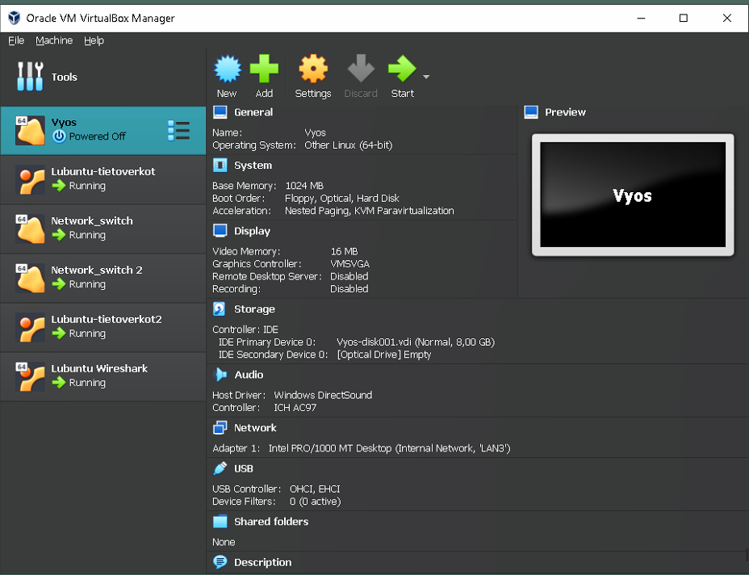
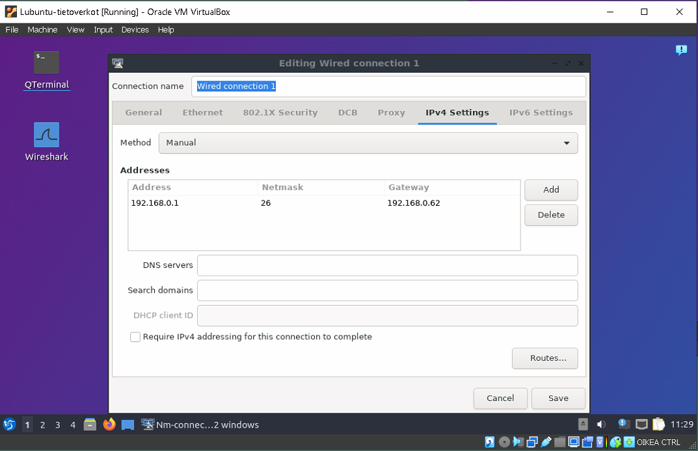

# Dokumentaatio tehtävään E04

<h2>Exercise 04 osion Topologiakuvat</h2>

<em>Alla korjattu Topologia aikasemmasta tehtästä (Exercise 02)</em>

<em>Upgrade: FYYSINEN TOPOLOGIA</em>

<em>LOOGINEN TOPOLOGIA</em>

<h2>Valmistellaan ympäristö topologiaan</h2>

Luodaan Vyos.

Vyos lanin nimeäminen.

Yhdistetään Kytkin2 Vyosin LANX Lähiverkkoon.

Luodaan port 3 Kytkin2.

<h2>Osoitteista laitteet manuaalisesti</h2>

Kirjaudutaan ensimmäistä kertaa Vyosiin.

Tarkistetaan asetuksia.

Luetaan Vyosin MAC osoite eli Hw-id.

Tarkistetaan, että mac osoitteet täsmää.

Kytkin2 asetuksia (tässä kohtaa tuli korjattua IP osoite .0.252 päätteiseksi, kun E02 osiossa loin vahingossa .0.52 päätteellä.

Kytkin1 vlan asetukset

Luodaan Kytkin1 vlan nimeltä "puuhamaa" ja port 2 tagged.

Kytkin2 vlan asetukset

Luodaan Kytkin2 vlan nimeltä "puuhamaa". Tässä lisättiin vlan "puuhamaa" untaggedina porttiin 2, joka on yhteydessä Lubuntu-Tietoverkko2 virtuaalikoneeseen.

Lopuliset vlan configuraatiot Kytkin2, yhteydet Kytkin1 ja Vyossiin menevät porteista 1,3 tagged, yhteys Lubuntu-Tietoverkko2 virtuaalikoneeseen port 2 untagged.

Aloitetaan Vyosissa aliverkoitus vlan workstationille ja vlan puuhamaalle, aliverkotusavaruus on 50 päätelaitteelle.

Tarkistetaan muutoksia reitittimessä

Tallennetaan asetukset

Tarkistetaan muutokset ja lisättiin Description vlan ip-osotteille, jotta tunnistamme aliverkotusavaruus.

Tarkistetaan ip route network addressiin.

Kuvassa näytetään nimetty Vyos "Reititin1"

<h2>Osoitteista Lubuntut manuaalisesti</h2>

Vaihdetaan virtuaalikoneiden lähiverkot. Lubuntu-tietoverkot virtuaalikone liitetään vlan "workstations" osoiteavaruuteen.

Tarkistetaan muuttunut Ip-osoite terminaalista

Sama toimenpide Lubuntu-Tietoverkko2 virtuaalikoneelle. Tämä liitetään vlan "puuhamaa" osoiteavaruuteen.

Tarkistetaan muuttunut Ip-osoite terminaalista

Testataan yhteyden toimivuus pingaamalla reitittimen pääteosoitteeseen.
Huomaamme, että yhteys toimii.

Tässä pienen källin korjaus, workstations yhteyttä ei ollut tagattu Kytkin2 asetuksista Reititin1, niin emme saanneet Lubuntu-Tietoverkko2 yhteyttä Lubuntu-tietoverkot Ip-osoiteseen.
Configuraation korjaamisen jälkeen yhteydet toimii.

Tässä vielä uudelleen pikakatsaus Kytkin2 asetuksista, nyt on vlan workstationille port 1,3 tagged ja 2 untagged.

Traceroutataan Lubuntu-Tietoverkko2 koneelta Lubuntu-tietoverkko virtuaalikoneeseen. Yhteys toimii.

<h2>Osoitteista kytkimet manuaalisesti</h2>

Luodaan vlan "network_devices", poistan aikasemmissa harjoituksissa tehdyt kytkinten ip osoitteet.

Luodaan Vyos_Reititin1 aliverkko network_devicesille

Reitittimen interface-lista

Asetetaan kytkimille omat Ip-osoitteet vlan "network_devices" aliverkkoavaruudesta.

<h2>Yhteystestaukset</h2>

Testaamme pingausta Lubuntu-tietoverkko virtuaalikoneelta:

Lubuntu -> lubuntu
Lubuntu -> Vyos
Lubuntu -> Switch

Huomaamme, ettemme saa enään yhteyttä kytkimiin.

Sama tracerouttauksella:

Sama toimenpide suorittettu Lubuntu-Tietoverkko2 virtuaalikoneella. Sama lopputulos.

Luodaan reitittimelle ssh -yhteys port 22:

Testataan ssh-yhteyttä Lubuntu-tietoverkko virtuaalikoneelta, TOIMII!

Lopussa sama Lubuntu-Tietoverkko2 virtuaalikoneella:

<h2>TÄYDENNYS</h2>

Olin unohtanut asentaa oletusyhdyskäytävän kytkimille:

Varmistin vielä, että Kytkin2 portti on tagged

Yhteydet toimii! Kuvassa Lubuntu1 ja 2 pingaukset ja traceroutet kytkimiin
