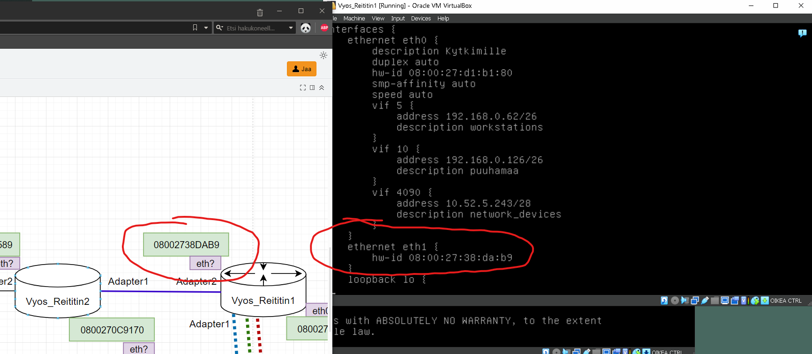
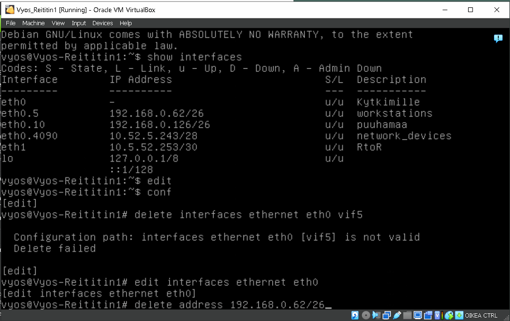

# Dokumentaatio tehtävään E05

<h2>Exercise 05 osion Topologiakuvat</h2>

<em>FYYSINEN TOPOLOGIA</em>

<em>LOOGINEN TOPOLOGIA</em>

<h2>Staattinen reititys</h2>

Kopioidaan Lubuntusta 3 versio

Samoin Reititimesta 2 versio

Yhdistetän Reititin1 Adapter1/eth1 RtoR sisäiseen verkkoon

Tehdään samainen kytkentä Reititin2 asetuksista 1 Adapter1/eth0 kytkimeen

Luodaan LAN5 Adapteri2/eth1, joka yhdistetään Lubuntu-Tietoverkko3

Asetetaan Lubuntu-tietoverkko3 Adapter1 yhdistymään LAN5 sisäiseen verkkoon, nämä yhdistyvät Reititin2 kanssa

Avataan Reititin2 ja nimetään se, jotta tunnistetaan konsoli (oli kopioidessa jäänny nimi Reititin1)

Tarkistetaan Reititin1 eth1 kytkimen rajapinta kytkimen mac osoitteen avulla

Tarkistetaan Reititin1 eth1 kytkimen rajapinta kytkimen mac osoitteen avulla (HUOM! Nämä arvot muuttuvat myöhemmässä vaiheessa, kun jouduin jälkikäteen korjailemaan omia virheitä)

Tarkistetaan Lubuntu3 enp0s3 mac osoite terminaalin avulla

Asetetetaan aliverkkoosoite Reititin1 ja annetaan kuvaus laitteelle, jotta tunnistamme sen myöhemmin

Reititin1 asetuksia eri rajapinnoista

Reititin1 lista yhteyksistä (HUOM! eth1 osoitteessa typo)

Samoja asetuksia Reititin2 rajapinnoille (Halusin LAN5 nimetä lankamaaksi :-))

Reititin2 lista yhteyksistä

Tässä vaiheessa tehtävää iski paniikki, kun tajusin, ettei IP-osoitteeni täsmännyt omia IP-osoitteita (Topologiassa oli eri IP:t kuin tietokoneessa konkreettisesti, olin ottanut ne esimerkistä....)

Elikkäs aletaan poistamaan jo tehtyjä asetuksia 

Kuvaa IP vaihdoksista

Lubuntu1 vaihtettu manuaalisesti IP oikein

Sama Lubuntu2

Tässä vaiheessa luulin olevani kuivilla, kun Lubuntu 1 ja 2 löysivät toisensa

Reititin1 uudelleen konfigurointia

Reititin2 DHCP asetukset

Lubuntu3 manuaalisesti lisätty IP ja tarkistetaan muutos terminaalista

Ping toimii Lubuntu3 -> Reititin2, luulen olevani voittaja

Tarkistetaan, että DHCP toimii

<h2>Staattisten reittien luonti</h2>

Reitin2 staattiset reitit

Reititin2 ip route configuraatiot

Reititin1 staattinen reitti Lubuntu3

Tässä vaiheessa olin vahingossa sammuttanut Reititin2 väärin ja asetukset nollaantuivat (HUOM eth0 ja eth1)
Ei muutakuin uudelleen laittamaan asetuksia paikoilleen

Yli 9h tehtävän kanssa painimisen jälkeen yhteydet saatiin pelittämään, alla kuvakaappaus pingaus Lubuntu 3 -> 1

<h2>Yhteystestauksia</h2>

LUBUNTU1 -> LUBUNTU3

LUBUNTU2 -> LUBUNTU3

<h2>DHCP Leashes</h2>

<h2>Loppupohdintoja</h2>
Tehtävä antoi kevyen pintaraapaisun, mitä tapahtuu, kun homma kosahtaa nilkoille. Todenteolla jouduin pohtimaan ja käymään palapalatla läpi, jotta sain korjattua rikkinäisen verkkoni eheäksi ja laitteet kommunikoimaan keskenään. 
Konffauksien käskyt tulevat ainakin luonnostaan ja nyt on selkeämpi käsitys Vyos/ExOS ympäristöstä ja sen kanssa toimimisesta.
