# Dokumentaatio tehtävään E06

<h1>Ehdotetut laitteet</h1>

<h2>Työasemat</h2>
Acer Aspire XC-840

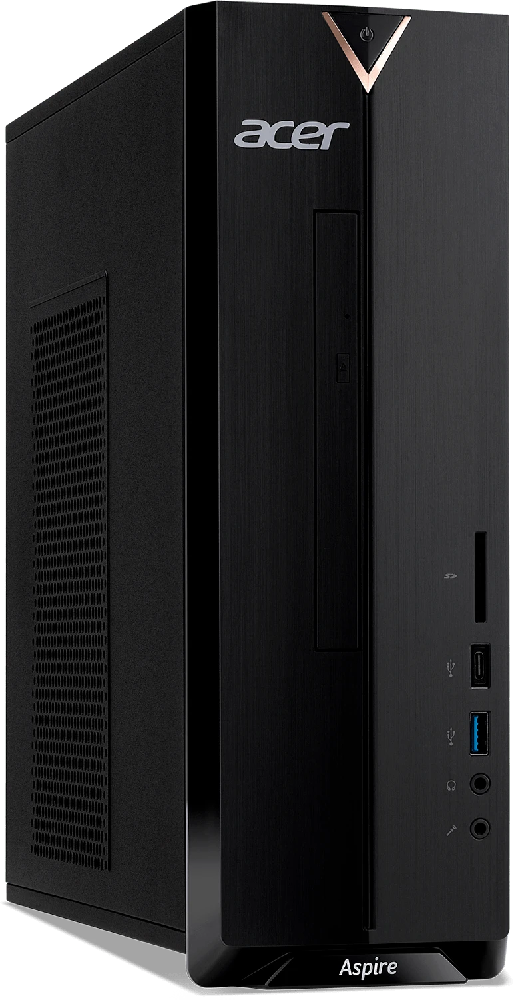

<b>Tekniset tiedot:</b>
Malli - DT.BH4EQ.003
Prosessori - Intel® Pentium® Silver N6005 2 Ghz
Keskusmuisti - 8GB DDR4
Näytönohjain - Intel® UHD Graphics
Kiintolevy - 512GB M.2 2280 PCI-ESSD
Windows 11 Home -käyttöjärjestelmä

<b>Tietoliikenne</b>
Verkkokortti - WLAN 802.11ac/a/b/g/n
Bluetooth 5

<b>Liittimet</b>
1 x USB 3.2 Type-C
1 x USB 3.2
4 x USB 2.0
3.5mm combo audio jack
1 x HDMI
1 x Ethernet (RJ-45)

<b>Äänet</b>
Integroitu hd 5.1 kanavainen surround äänikortti

<b>Mitat ja paino</b>
100 (W) x 330 (D) x 295 (H) mm

<b>Perustelut:</b>
- Valitsin tämän laitteen, koska vaatimuksissa ei ollut muita kuin se, että Linux Lubuntu pyörii moitteettomasti.
Lubuntun vaatimukset:

- "The minimum requirements are a 700 MHz single processor, 512 MB of RAM, and 5 GB of memory."

<h2>Reitittimet</h2>
HPE FlexNetwork MSR2003	AC-reititin

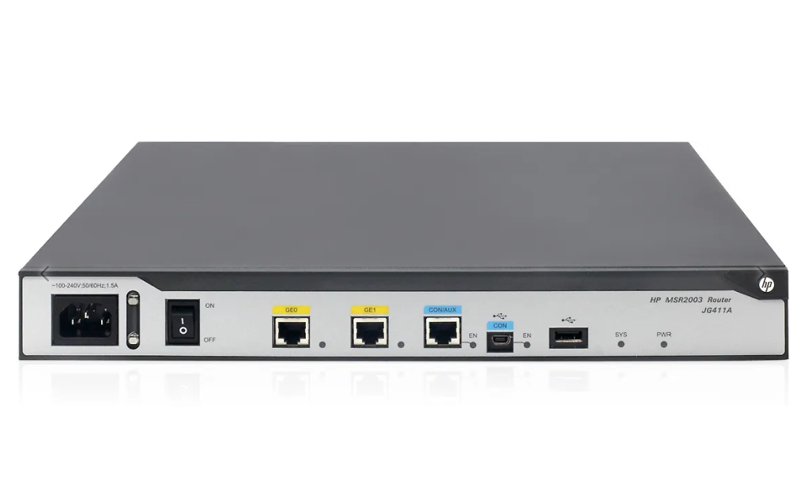

<b>Tekniset tiedot</b>

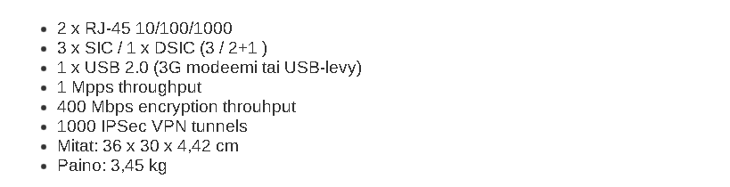

<b>Perustelut</b>
- Valitsin tämän reitittimen lähinnä nopeuden takia, ainakin hintansa puolesta voin päätellä, että tehoja riittää.

<h2>Kytkimet</h2>
HPE Aruba 2530-48 Switch - 48-porttinen kytkin

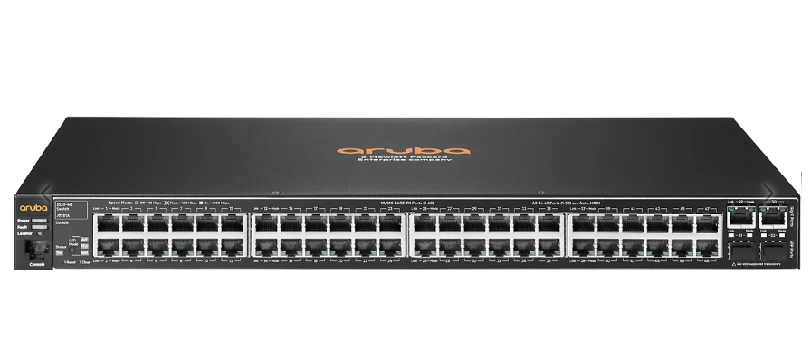

<b>Tekniset tiedot</b>

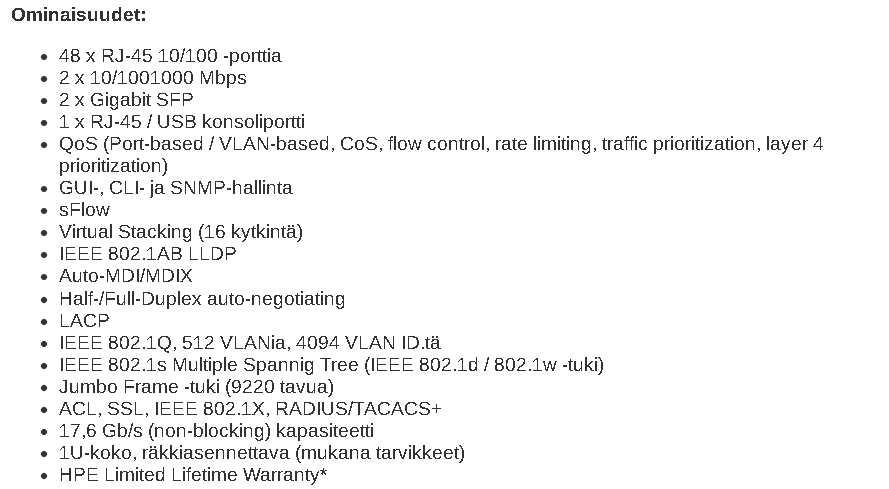

<b>Perustelut</b>
- RJ-45 kytkinportit x 48 kpl
- Laitekaappiin asennusosat tulevat mukana
- Voidaan hallita komentokehoitteen kautta (CLI)
- Elinikäinen laitetakuu ensimmäisellä omistajalla
- Sopii pienen toimistoyrityksen käyttöön

<h2>Kaapelit ja virtalähteet</h2>

Verkkokaapeli, CAT 6 FTP/LSZH, 1 m & 3 m

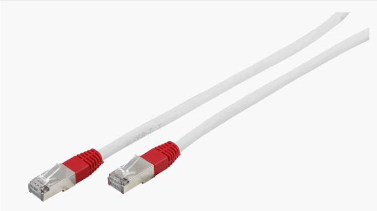

<b>Perustelut</b>
- 0,25 m kaapeleilla saadaan kytkettyä kytkimet kiinni toisiinta aka laajennus
- 1 m kaapeleilla saadaa kytkettyä yhteys Router1 -> Switch1 ja Switch2 kiinni
- 3 m kaapelilla saadaan kytkettyä yhteys Router2 -> Lubuntu-tietoverkko3 pöytäkoneeseen kiinni
- 3 m kaapelilla saadaan kytkettyä yhteys Router2 -> Lubuntu-tietoverkko3 pöytäkoneeseen kiinni

Nedis 50 m CAT6 F/UTP verkkokaapeli

<i>Ei kuvaa</i>

<b>Perustelut</b>
- 50 m kaapelilla saadaan vedettyä yhteys eri kerroksessa/tilassa oleviin Lubuntu-tietoverkko1 & Lubuntu-tietoverkko2

Deltaco GT-8634 -virtapaneeli, musta

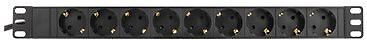

<h2>Laitekaapit</h2>
DEMOSTAR laitekaappi 20U

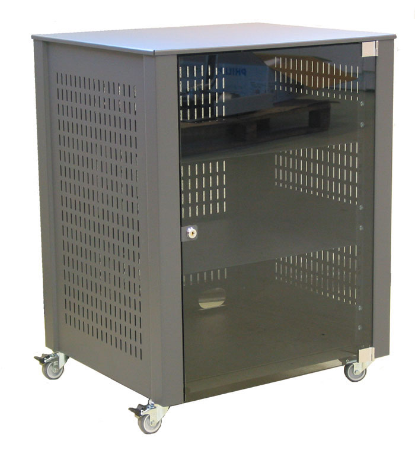

<b>Perustelut</b>
- Pieni koko ja sisäänrakennetut tasot, tarkoituksena ei ole laajentua tästä.

<h2>Tietoverkkokaapelointi</h2>

<b>BUDJETTITAULUKKO
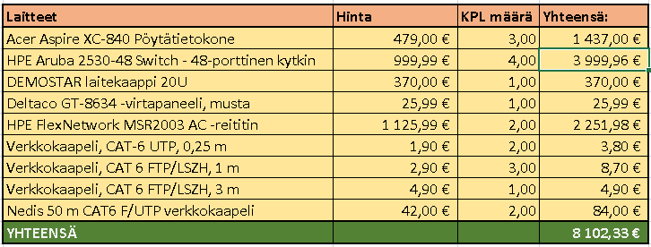

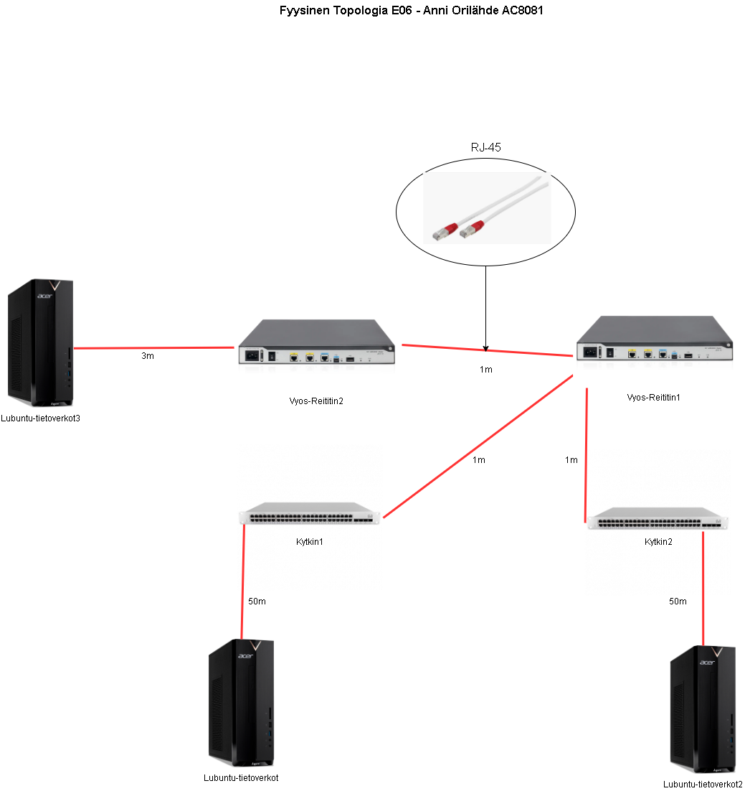

<h2>Fyysinen asennuskuva</h2>

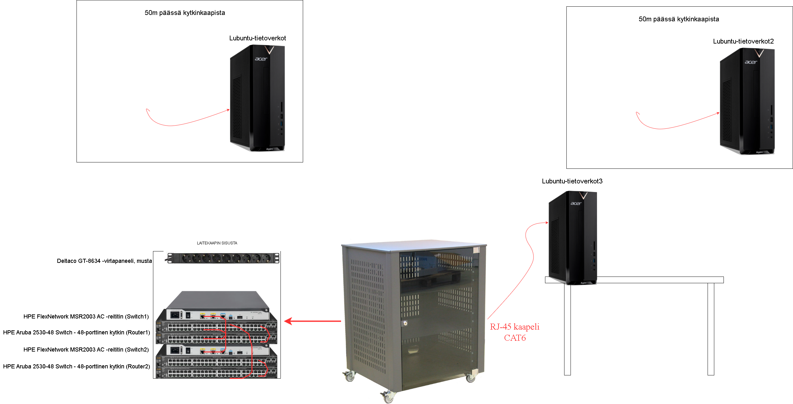