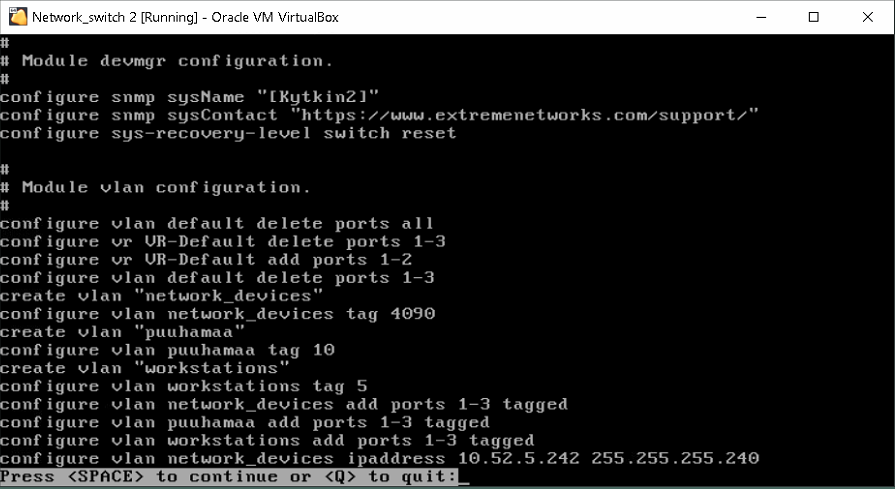
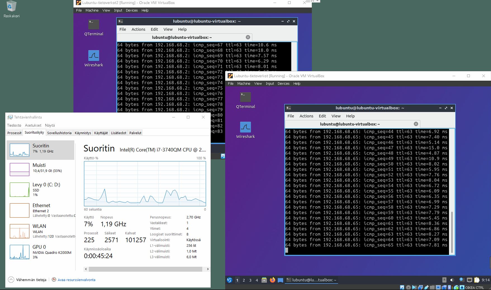

# Dokumentaatio tehtävään E07

<h2>FYYSINEN TOPOLOGIA</h2>


<h2>LOOGINEN TOPOLOGIA</h2>


<h2>Kytkinten asetukset Oraclessa</h2>

<h3>Kytkin1</h3>


<h3>Kytkin3</h3>


<h2>Kytkinten asetukset</h2>

<h3>Kytkin1</h3>


<h3>Kytkin2</h3>



<h3>Kytkin3</h3>


<h2>Laitetaan STP päälle</h2>
1. Käynnistä kytkimet yksi kerrallaan
2. Laita Spanning-Tree Protocol päälle kaikissa VLANeissa kaikissa kytkimissä
3. Laita Spanning-Tree Protocol päälle kaikissa kytkimissä
4. Kun valmista, tallenna konfiguraatio ja käynnistä kaikki kytkimet
5. Aloita jälleen liikennöinti lubuntulta toiselle
Tarkkaile Task Manager:sta CPU:n käyttöä.

Ennen STP:tä


<p>Huomataan, että kun pingi liikkuu vapaana kytkinten välillä, se vie fyysisen tietokoneen prosessin muistia</p>

Laitetaan STP päälle



<h2>Tutkitaan porttien tiloja</h2>
<p>1. Tulosta kaikki porttien tilat kaikilta kytkimiltä komennoilla: show stpd s0 ja show stpd s0 ports</p>


<p>2. Päivitä/Piirrä Spanning-Tree topologiakuva</p>


<p>3. Mikä/Missä on juurikytkin?</p>
<p>Kytkin2</p>

<p>4. Mitkä ovat porttien tilat jokaisella kytkimellä?</p>


<p>HUOM! Kuvassa virheellisesti Reititin2 vaikka todellisuudessa on Reititin1</p>

<em>Vastaa kysymykseen: Onko juurikytkimen sijanti ihanteellinen? Edelleenlähettävätkö (porttien tiloista päätellen) kytkimet kuten olisit odottanut?</em>

<p>Vielä en osaa antaa tarkkaa vastausta, tähän vaiheeseen tarvitsin luokkatovereiden apua ja he sanoivat, että minulla kävi tuuri, että kytkimet asettuivat ihanteelliseen 
sijaintiin automaattisesti, eikä minun tarvinnut erikseen niitä enää konfiguroida</em>

<h2>Määritellään juurikytkin</h2>
<p>1. Suunnittele päivitys kytkinverkkoon konfiguroimalla Spanning-Tree kytkinprioriteetit</p>
<p>2. Kytkinten uudelleenkäynnistys vaaditaan että juurikytkin tulee valituksi uudelleen</p>
<p>3. Tulosta ulos kaikki show stpd s0 ja show stpd s0 ports tulosteet kytkimistä</p>


<h3>KYTKIN1</h3>

```
[Kytkin1].1 # show stpd s0
Stpd: s0                Stp: ENABLED            Number of Ports: 3
Rapid Root Failover: Disabled
Operational Mode: MSTP                  Default Binding Mode: 802.1D
MSTI Instance:  CIST
802.1Q Tag: (none)
Ports: 1,2,3
Participating Vlans: network_devices,puuhamaa,workstations
Auto-bind Vlans: Default
Bridge Priority            : 32768              Bridge Priority Mode: 802.1t
Operational Bridge Priority: 32768
BridgeID                   : 80:00:08:00:27:ed:27:2f
Designated root            : 10:00:08:00:27:1d:c9:f8
CIST Root                  : 10:00:08:00:27:1d:c9:f8
CIST Regional Root         : 10:00:08:00:27:1d:c9:f8
External RootPathCost      : 0  Internal RootPathCost: 200000 
Root Port   : 2         
MaxAge      : 20s       HelloTime     : 2s      ForwardDelay     : 15s
CfgBrMaxAge : 20s       CfgBrHelloTime: 2s      CfgBrForwardDelay: 15s
RemainHopCount: 19      CfgMaxHopCount: 20
Topology Change Time           : 35s            Hold time        : 1s
Topology Change Detected       : FALSE          Topology Change  : FALSE
Number of Topology Changes     : 2
Time Since Last Topology Change: 373s
Topology Change initiated locally on Port 2
Topology Change last received on Port 2 from 08:00:27:1d:c9:f8
Backup Root               : Off         Backup Root Activated  : FALSE
Loop Protect Event Window : 180s        Loop Protect Threshold : 3
New Root Trap             : On          Topology Change Trap   : Off
Tx Hold Count             : 6

[Kytkin1].2 # show stpd s0 ports
Port     Mode   State      Cost  Flags     Priority Port ID Designated Bridge
1      802.1D FORWARDING 200000 eDappw--B- 128      8001    80:00:08:00:27:ed:27:2f
2      802.1D FORWARDING 200000 eRapam--I- 128      8002    10:00:08:00:27:1d:c9:f8
3      802.1D BLOCKING   200000 eAapam--I- 128      8003    80:00:08:00:27:62:1d:91

Total Ports: 3
```

<h3>KYTKIN2</h3>

```
[Kytkin2].1 # show stpd s0
Stpd: s0                Stp: ENABLED            Number of Ports: 3
Rapid Root Failover: Disabled
Operational Mode: MSTP                  Default Binding Mode: 802.1D
MSTI Instance:  CIST
802.1Q Tag: (none)
Ports: 1,2,3
Participating Vlans: network_devices,puuhamaa,workstations
Auto-bind Vlans: Default
Bridge Priority            : 4096               Bridge Priority Mode: 802.1t
Operational Bridge Priority: 4096
BridgeID                   : 10:00:08:00:27:1d:c9:f8
Designated root            : 10:00:08:00:27:1d:c9:f8
CIST Root                  : 10:00:08:00:27:1d:c9:f8
CIST Regional Root         : 10:00:08:00:27:1d:c9:f8
External RootPathCost      : 0  Internal RootPathCost: 0 
Root Port   : ----      
MaxAge      : 20s       HelloTime     : 2s      ForwardDelay     : 15s
CfgBrMaxAge : 20s       CfgBrHelloTime: 2s      CfgBrForwardDelay: 15s
RemainHopCount: 20      CfgMaxHopCount: 20

[Kytkin2].2 # show stpd s0 ports
Port     Mode   State      Cost  Flags     Priority Port ID Designated Bridge
1      802.1D FORWARDING 200000 eDap-m--I- 128      8001    10:00:08:00:27:1d:c9:f8
2      802.1D FORWARDING 200000 eDap-m--I- 128      8002    10:00:08:00:27:1d:c9:f8
3      802.1D FORWARDING 200000 eDappw--B- 128      8003    10:00:08:00:27:1d:c9:f8

Total Ports: 3
```

<h3>KYTKIN3</h3>

```
<Kytkin3>.1 # show stpd s0
Stpd: s0                Stp: ENABLED            Number of Ports: 3
Rapid Root Failover: Disabled
Operational Mode: MSTP                  Default Binding Mode: 802.1D
MSTI Instance:  CIST
802.1Q Tag: (none)
Ports: 1,2,3
Participating Vlans: network_devices,puuhamaa,workstations
Auto-bind Vlans: Default
Bridge Priority            : 32768              Bridge Priority Mode: 802.1t
Operational Bridge Priority: 32768
BridgeID                   : 80:00:08:00:27:62:1d:91
Designated root            : 10:00:08:00:27:1d:c9:f8
CIST Root                  : 10:00:08:00:27:1d:c9:f8
CIST Regional Root         : 10:00:08:00:27:1d:c9:f8
External RootPathCost      : 0  Internal RootPathCost: 200000 
Root Port   : 1         
MaxAge      : 20s       HelloTime     : 2s      ForwardDelay     : 15s
CfgBrMaxAge : 20s       CfgBrHelloTime: 2s      CfgBrForwardDelay: 15s
RemainHopCount: 19      CfgMaxHopCount: 20
Topology Change Time           : 35s            Hold time        : 1s
Topology Change Detected       : FALSE          Topology Change  : FALSE
Number of Topology Changes     : 2
Time Since Last Topology Change: 584s
Topology Change initiated locally on Port 3
Topology Change last received on Port none from none
Backup Root               : Off         Backup Root Activated  : FALSE
Loop Protect Event Window : 180s        Loop Protect Threshold : 3
New Root Trap             : On          Topology Change Trap   : Off
Tx Hold Count             : 6

<Kytkin3>.2 # show stpd s0 ports
Port     Mode   State      Cost  Flags     Priority Port ID Designated Bridge
1      802.1D FORWARDING 200000 eRapam--I- 128      8001    10:00:08:00:27:1d:c9:f8
2      802.1D FORWARDING 200000 eDappw--B- 128      8002    80:00:08:00:27:62:1d:91
3      802.1D FORWARDING 200000 eDap-m--I- 128      8003    80:00:08:00:27:62:1d:91

Total Ports: 3
```


4. Piirrä/päivitä Spanning-Tree kuva uudelleen muutosten jälkeen
<p>Minun ei tarvinnut tehdä muutoksia, kun kytkimet asettuivat automaattisesti ihanteelliseen sijaintiin</p>

<h2>Mitataan muutosten vaikutukset topologiassa</h2>
1. Laita yksi Lubuntu -työasema aktiivisesti pingaamaan toista työasemaa
2. Valitse yksi porteista juurikytkimeltä ja laita se pois päältä komennolla disable port <#>
3. Mittaa ja dokumentoi katkos ping:stä laitteiden välillä
<h3>Lubuntu-tietoverkot1</h3>

```
64 bytes from 192.168.68.65: icmp_seq=36 ttl=63 time=7.92 ms
64 bytes from 192.168.68.65: icmp_seq=37 ttl=63 time=8.71 ms
64 bytes from 192.168.68.65: icmp_seq=38 ttl=63 time=8.96 ms
64 bytes from 192.168.68.65: icmp_seq=50 ttl=63 time=7.45 ms
64 bytes from 192.168.68.65: icmp_seq=51 ttl=63 time=8.65 ms
64 bytes from 192.168.68.65: icmp_seq=52 ttl=63 time=6.14 ms
64 bytes from 192.168.68.65: icmp_seq=53 ttl=63 time=8.06 ms
```

<h3>Lubuntu-tietoverkot2</h3>

```
64 bytes from 192.168.68.2: icmp_seq=34 ttl=63 time=7.10 ms
64 bytes from 192.168.68.2: icmp_seq=35 ttl=63 time=6.71 ms
64 bytes from 192.168.68.2: icmp_seq=36 ttl=63 time=6.82 ms
64 bytes from 192.168.68.2: icmp_seq=48 ttl=63 time=8.75 ms
64 bytes from 192.168.68.2: icmp_seq=49 ttl=63 time=7.18 ms
64 bytes from 192.168.68.2: icmp_seq=50 ttl=63 time=8.56 ms
64 bytes from 192.168.68.2: icmp_seq=51 ttl=63 time=9.94 ms
```

Sinun mahdollisesti täytyy enabloida/disabloida portti useita kertoja, jotta saat toivotun vaikutuksen
4. Tulosta ulos kaikki show stpd s0 ja show stpd s0 ports tulosteet kytkimistä

<h3>KYTKIN1</h3>

```
[Kytkin1].1 # show stpd s0
Stpd: s0                Stp: ENABLED            Number of Ports: 3
Rapid Root Failover: Disabled
Operational Mode: MSTP                  Default Binding Mode: 802.1D
MSTI Instance:  CIST
802.1Q Tag: (none)
Ports: 1,2,3
Participating Vlans: network_devices,puuhamaa,workstations
Auto-bind Vlans: Default
Bridge Priority            : 32768              Bridge Priority Mode: 802.1t
Operational Bridge Priority: 32768
BridgeID                   : 80:00:08:00:27:ed:27:2f
Designated root            : 10:00:08:00:27:1d:c9:f8
CIST Root                  : 10:00:08:00:27:1d:c9:f8
CIST Regional Root         : 10:00:08:00:27:1d:c9:f8
External RootPathCost      : 0  Internal RootPathCost: 200000 
Root Port   : 2         
MaxAge      : 20s       HelloTime     : 2s      ForwardDelay     : 15s
CfgBrMaxAge : 20s       CfgBrHelloTime: 2s      CfgBrForwardDelay: 15s
RemainHopCount: 19      CfgMaxHopCount: 20
Topology Change Time           : 35s            Hold time        : 1s
Topology Change Detected       : FALSE          Topology Change  : FALSE
Number of Topology Changes     : 7
Time Since Last Topology Change: 126s
Topology Change initiated locally on Port 3
Topology Change last received on Port 3 from 08:00:27:62:1d:91
Backup Root               : Off         Backup Root Activated  : FALSE
Loop Protect Event Window : 180s        Loop Protect Threshold : 3
New Root Trap             : On          Topology Change Trap   : Off
Tx Hold Count             : 6

[Kytkin1].2 # show stpd s0 ports
Port     Mode   State      Cost  Flags     Priority Port ID Designated Bridge
1      802.1D FORWARDING 200000 eDappw--B- 128      8001    80:00:08:00:27:ed:27:2f
2      802.1D FORWARDING 200000 eRapam--I- 128      8002    10:00:08:00:27:1d:c9:f8
3      802.1D FORWARDING 200000 eDap-m--I- 128      8003    80:00:08:00:27:ed:27:2f

Total Ports: 3
```

<h3>KYTKIN2</h3>

```
[Kytkin2].1 # show stpd s0
Stpd: s0                Stp: ENABLED            Number of Ports: 3
Rapid Root Failover: Disabled
Operational Mode: MSTP                  Default Binding Mode: 802.1D
MSTI Instance:  CIST
802.1Q Tag: (none)
Ports: 1,2,3
Participating Vlans: network_devices,puuhamaa,workstations
Auto-bind Vlans: Default
Bridge Priority            : 4096               Bridge Priority Mode: 802.1t
Operational Bridge Priority: 4096
BridgeID                   : 10:00:08:00:27:1d:c9:f8
Designated root            : 10:00:08:00:27:1d:c9:f8
CIST Root                  : 10:00:08:00:27:1d:c9:f8
CIST Regional Root         : 10:00:08:00:27:1d:c9:f8
External RootPathCost      : 0  Internal RootPathCost: 0 
Root Port   : ----      
MaxAge      : 20s       HelloTime     : 2s      ForwardDelay     : 15s
CfgBrMaxAge : 20s       CfgBrHelloTime: 2s      CfgBrForwardDelay: 15s
RemainHopCount: 20      CfgMaxHopCount: 20
Topology Change Time           : 35s            Hold time        : 1s
Topology Change Detected       : FALSE          Topology Change  : FALSE
Number of Topology Changes     : 7
Time Since Last Topology Change: 170s
Topology Change initiated locally on Port 2
Topology Change last received on Port 1 from 08:00:27:ed:27:2f
Backup Root               : Off         Backup Root Activated  : FALSE
Loop Protect Event Window : 180s        Loop Protect Threshold : 3
New Root Trap             : On          Topology Change Trap   : Off
Tx Hold Count             : 6


[Kytkin2].2 # show stpd s0 ports
Port     Mode   State      Cost  Flags     Priority Port ID Designated Bridge
1      802.1D FORWARDING 200000 eDap-m--I- 128      8001    10:00:08:00:27:1d:c9:f8
2      802.1D DISABLED   200000 e?ab-m--I- 128      8002    00:00:00:00:00:00:00:00
3      802.1D FORWARDING 200000 eDappw--B- 128      8003    10:00:08:00:27:1d:c9:f8

Total Ports: 3
```

<h3>KYTKIN3</h3>

```
<Kytkin3>.1 # show stpd s0
Stpd: s0                Stp: ENABLED            Number of Ports: 3
Rapid Root Failover: Disabled
Operational Mode: MSTP                  Default Binding Mode: 802.1D
MSTI Instance:  CIST
802.1Q Tag: (none)
Ports: 1,2,3
Participating Vlans: network_devices,puuhamaa,workstations
Auto-bind Vlans: Default
Bridge Priority            : 32768              Bridge Priority Mode: 802.1t
Operational Bridge Priority: 32768
BridgeID                   : 80:00:08:00:27:62:1d:91
Designated root            : 80:00:08:00:27:ed:27:2f
CIST Root                  : 10:00:08:00:27:1d:c9:f8
CIST Regional Root         : 10:00:08:00:27:1d:c9:f8
External RootPathCost      : 0  Internal RootPathCost: 400000 
Root Port   : 3         
MaxAge      : 20s       HelloTime     : 2s      ForwardDelay     : 15s
CfgBrMaxAge : 20s       CfgBrHelloTime: 2s      CfgBrForwardDelay: 15s
RemainHopCount: 18      CfgMaxHopCount: 20
Topology Change Time           : 35s            Hold time        : 1s
Topology Change Detected       : FALSE          Topology Change  : FALSE
Number of Topology Changes     : 7
Time Since Last Topology Change: 240s
Topology Change initiated locally on Port 1
Topology Change last received on Port 3 from 08:00:27:ed:27:2f
Backup Root               : Off         Backup Root Activated  : FALSE
Loop Protect Event Window : 180s        Loop Protect Threshold : 3
New Root Trap             : On          Topology Change Trap   : Off
Tx Hold Count             : 6

<Kytkin3>.2 # show stpd s0 ports
Port     Mode   State      Cost  Flags     Priority Port ID Designated Bridge
1      802.1D FORWARDING 200000 eDappm--I- 128      8001    80:00:08:00:27:62:1d:91
2      802.1D FORWARDING 200000 eDappw--B- 128      8002    80:00:08:00:27:62:1d:91
3      802.1D FORWARDING 200000 eRapam--I- 128      8003    80:00:08:00:27:ed:27:2f

Total Ports: 3
```


5. Piirrä/päivitä Spanning-Tree kuva uudelleen portin poispäältä laittamisen jälkeen


