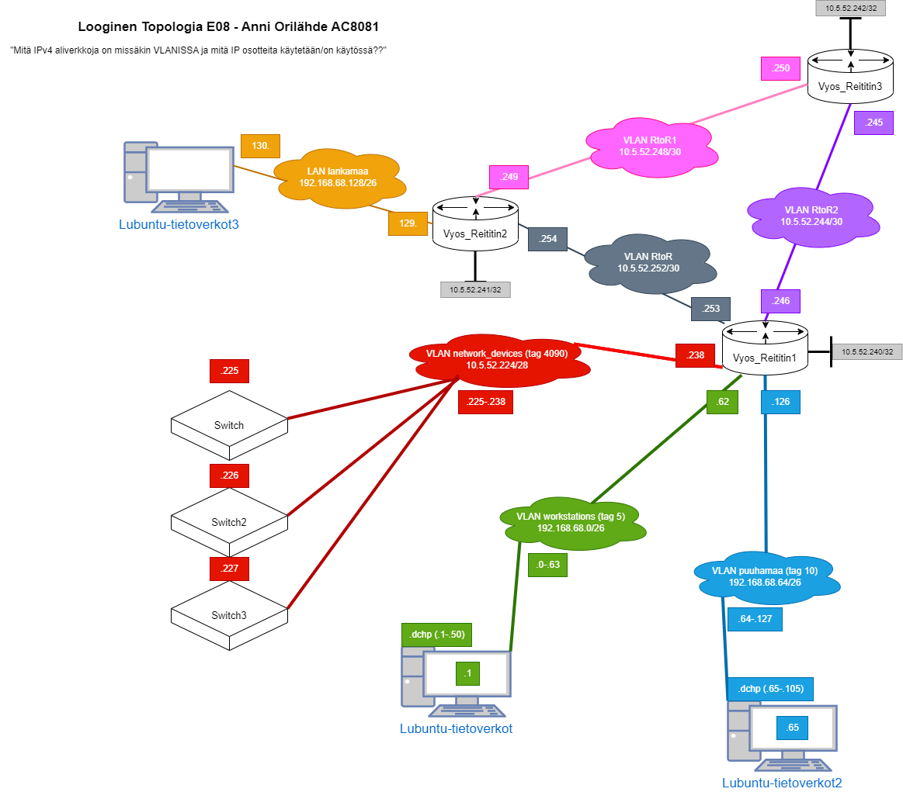
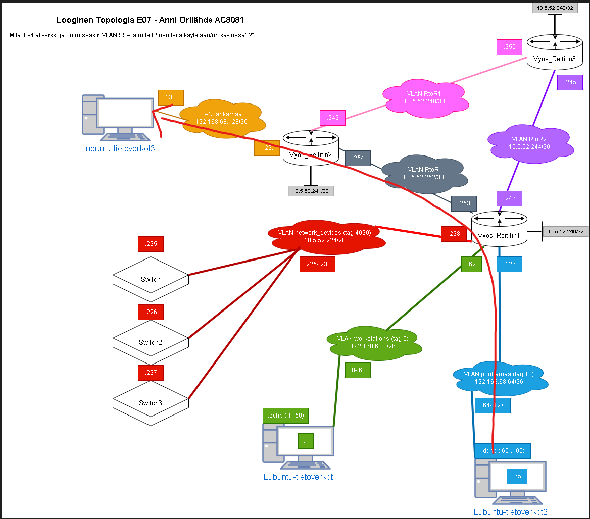

# Dokumentaatio tehtävään E08

<p>Pohjustusta: huomasin, että olin aikasemmissa tehtävissä tehnyt virheen osotteiden kanssa, 
tässä tehtävässä on päivitetty topologiat ja osoitetaulut.</p>
<p>Samoin jouduin aloittamaan tämän tehtävän alusta pari kertaa</p>

<h2>FYYSINEN TOPOLOGIA<h2>


<h2>LOOGINEN TOPOLOGIA</h2>



<h2>Kopioidaan Reititin3</h2>
<p>Tarkistetaan samalla kytkimet kuntoon topologian mukaisesti.</p>


<h2>Kytkinten sisäiset konfit kuntoon</h2>


<h3>Poistetaan staattiset protocollat</h3>


<h3>Kuunnellaan Wiresharkilla yhteyksiä RtoR2 välillä</h3>


<h2>Tarkastetaan reittitaulu</h2>

<h3>Kytkin1</h3>

```
vyos@Vyos-Reititin1:~$ show ip ospf neighbor

Neighbor ID     Pri State           Dead Time Address         Interface            RXmtL RqstL DBsmL
10.5.52.241       1 Full/DR           35.061s 10.5.52.254     eth1:10.5.52.253         0     0     0
10.5.52.242       1 Full/DR           34.932s 10.5.52.245     eth2:10.5.52.246         0     0     0

vyos@Vyos-Reititin1:~$ show ip route
Codes: K - kernel route, C - connected, S - static, R - RIP,
       O - OSPF, I - IS-IS, B - BGP, E - EIGRP, N - NHRP,
       T - Table, v - VNC, V - VNC-Direct, A - Babel, D - SHARP,
       F - PBR, f - OpenFabric,
       > - selected route, * - FIB route

C>* 10.5.52.224/28 is directly connected, eth0.4090, 00:12:07
O   10.5.52.240/32 [110/0] is directly connected, lo, 00:12:00
C>* 10.5.52.240/32 is directly connected, lo, 00:12:23
O>* 10.5.52.241/32 [110/100] via 10.5.52.254, eth1, 00:11:17
O>* 10.5.52.242/32 [110/100] via 10.5.52.245, eth2, 00:11:12
O   10.5.52.244/30 [110/100] is directly connected, eth2, 00:11:17
C>* 10.5.52.244/30 is directly connected, eth2, 00:12:12
O>* 10.5.52.248/30 [110/200] via 10.5.52.254, eth1, 00:11:12
  *                          via 10.5.52.245, eth2, 00:11:12
O   10.5.52.252/30 [110/100] is directly connected, eth1, 00:11:22
C>* 10.5.52.252/30 is directly connected, eth1, 00:12:17
O   192.168.68.0/26 [110/100] is directly connected, eth0.5, 00:11:56
C>* 192.168.68.0/26 is directly connected, eth0.5, 00:12:07
O   192.168.68.64/26 [110/100] is directly connected, eth0.10, 00:11:57
C>* 192.168.68.64/26 is directly connected, eth0.10, 00:12:07
O>* 192.168.68.128/26 [110/200] via 10.5.52.254, eth1, 00:11:17

vyos@Vyos-Reititin1:~$ show ip route ospf
Codes: K - kernel route, C - connected, S - static, R - RIP,
       O - OSPF, I - IS-IS, B - BGP, E - EIGRP, N - NHRP,
       T - Table, v - VNC, V - VNC-Direct, A - Babel, D - SHARP,
       F - PBR, f - OpenFabric,
       > - selected route, * - FIB route

O   10.5.52.240/32 [110/0] is directly connected, lo, 00:12:10
O>* 10.5.52.241/32 [110/100] via 10.5.52.254, eth1, 00:11:27
O>* 10.5.52.242/32 [110/100] via 10.5.52.245, eth2, 00:11:22
O   10.5.52.244/30 [110/100] is directly connected, eth2, 00:11:27
O>* 10.5.52.248/30 [110/200] via 10.5.52.254, eth1, 00:11:22
  *                          via 10.5.52.245, eth2, 00:11:22
O   10.5.52.252/30 [110/100] is directly connected, eth1, 00:11:32
O   192.168.68.0/26 [110/100] is directly connected, eth0.5, 00:12:06
O   192.168.68.64/26 [110/100] is directly connected, eth0.10, 00:12:07
O>* 192.168.68.128/26 [110/200] via 10.5.52.254, eth1, 00:11:27

vyos@Vyos-Reititin1:~$ show ip ospf database

       OSPF Router with ID (10.5.52.240)

                Router Link States (Area 0.0.0.0)

Link ID         ADV Router      Age  Seq#       CkSum  Link count
10.5.52.240     10.5.52.240      701 0x8000000d 0xe4e1 5
10.5.52.241     10.5.52.241      707 0x80000009 0x64fc 4
10.5.52.242     10.5.52.242      703 0x80000007 0x4490 3

                Net Link States (Area 0.0.0.0)

Link ID         ADV Router      Age  Seq#       CkSum
10.5.52.245     10.5.52.242      702 0x80000001 0x750e
10.5.52.250     10.5.52.242      709 0x80000001 0x5528
10.5.52.254     10.5.52.241      707 0x80000001 0x1b61

vyos@Vyos-Reititin1:~$ 
```

<h3>Kytkin2</h3>

```
vyos@Reititin2:~$ show ip ospf neighbor

Neighbor ID     Pri State           Dead Time Address         Interface            RXmtL RqstL DBsmL
10.5.52.240       1 Full/Backup       37.564s 10.5.52.253     eth0:10.5.52.254         0     0     0
10.5.52.242       1 Full/DR           31.584s 10.5.52.250     eth2:10.5.52.249         0     0     0

vyos@Reititin2:~$ show ip route
Codes: K - kernel route, C - connected, S - static, R - RIP,
       O - OSPF, I - IS-IS, B - BGP, E - EIGRP, N - NHRP,
       T - Table, v - VNC, V - VNC-Direct, A - Babel, D - SHARP,
       F - PBR, f - OpenFabric,
       > - selected route, * - FIB route

O>* 10.5.52.240/32 [110/100] via 10.5.52.253, eth0, 00:13:39
O   10.5.52.241/32 [110/0] is directly connected, lo, 00:14:25
C>* 10.5.52.241/32 is directly connected, lo, 00:14:46
O>* 10.5.52.242/32 [110/100] via 10.5.52.250, eth2, 00:13:37
O>* 10.5.52.244/30 [110/200] via 10.5.52.253, eth0, 00:13:32
  *                          via 10.5.52.250, eth2, 00:13:32
O   10.5.52.248/30 [110/100] is directly connected, eth2, 00:13:43
C>* 10.5.52.248/30 is directly connected, eth2, 00:14:40
O   10.5.52.252/30 [110/100] is directly connected, eth0, 00:14:27
C>* 10.5.52.252/30 is directly connected, eth0, 00:14:33
O>* 192.168.68.0/26 [110/200] via 10.5.52.253, eth0, 00:13:39
O>* 192.168.68.64/26 [110/200] via 10.5.52.253, eth0, 00:13:39
O   192.168.68.128/26 [110/100] is directly connected, eth1, 00:14:24
C>* 192.168.68.128/26 is directly connected, eth1, 00:14:36

vyos@Reititin2:~$ show ip route ospf
Codes: K - kernel route, C - connected, S - static, R - RIP,
       O - OSPF, I - IS-IS, B - BGP, E - EIGRP, N - NHRP,
       T - Table, v - VNC, V - VNC-Direct, A - Babel, D - SHARP,
       F - PBR, f - OpenFabric,
       > - selected route, * - FIB route

O>* 10.5.52.240/32 [110/100] via 10.5.52.253, eth0, 00:13:47
O   10.5.52.241/32 [110/0] is directly connected, lo, 00:14:33
O>* 10.5.52.242/32 [110/100] via 10.5.52.250, eth2, 00:13:45
O>* 10.5.52.244/30 [110/200] via 10.5.52.253, eth0, 00:13:40
  *                          via 10.5.52.250, eth2, 00:13:40
O   10.5.52.248/30 [110/100] is directly connected, eth2, 00:13:51
O   10.5.52.252/30 [110/100] is directly connected, eth0, 00:14:35
O>* 192.168.68.0/26 [110/200] via 10.5.52.253, eth0, 00:13:47
O>* 192.168.68.64/26 [110/200] via 10.5.52.253, eth0, 00:13:47
O   192.168.68.128/26 [110/100] is directly connected, eth1, 00:14:32

vyos@Reititin2:~$ show ip ospf database

       OSPF Router with ID (10.5.52.241)

                Router Link States (Area 0.0.0.0)

Link ID         ADV Router      Age  Seq#       CkSum  Link count
10.5.52.240     10.5.52.240      842 0x8000000d 0xe4e1 5
10.5.52.241     10.5.52.241      846 0x80000009 0x64fc 4
10.5.52.242     10.5.52.242      842 0x80000007 0x4490 3

                Net Link States (Area 0.0.0.0)

Link ID         ADV Router      Age  Seq#       CkSum
10.5.52.245     10.5.52.242      842 0x80000001 0x750e
10.5.52.250     10.5.52.242      848 0x80000001 0x5528
10.5.52.254     10.5.52.241      846 0x80000001 0x1b61

vyos@Reititin2:~$ 
```

<h3>Kytkin3</h3>

```vyos@Reititin3:~$ show ip ospf neighbor

Neighbor ID     Pri State           Dead Time Address         Interface            RXmtL RqstL DBsmL
10.5.52.241       1 Full/Backup       35.487s 10.5.52.249     eth4:10.5.52.250         0     0     0
10.5.52.240       1 Full/Backup       30.422s 10.5.52.246     eth3:10.5.52.245         0     0     0

vyos@Reititin3:~$ show ip route
Codes: K - kernel route, C - connected, S - static, R - RIP,
       O - OSPF, I - IS-IS, B - BGP, E - EIGRP, N - NHRP,
       T - Table, v - VNC, V - VNC-Direct, A - Babel, D - SHARP,
       F - PBR, f - OpenFabric,
       > - selected route, * - FIB route

O>* 10.5.52.240/32 [110/100] via 10.5.52.246, eth3, 00:14:56
O>* 10.5.52.241/32 [110/100] via 10.5.52.249, eth4, 00:15:06
O   10.5.52.242/32 [110/0] is directly connected, lo, 00:15:50
C>* 10.5.52.242/32 is directly connected, lo, 00:16:07
O   10.5.52.244/30 [110/100] is directly connected, eth3, 00:15:51
C>* 10.5.52.244/30 is directly connected, eth3, 00:16:01
O   10.5.52.248/30 [110/100] is directly connected, eth4, 00:15:52
C>* 10.5.52.248/30 is directly connected, eth4, 00:15:58
O>* 10.5.52.252/30 [110/200] via 10.5.52.249, eth4, 00:14:56
  *                          via 10.5.52.246, eth3, 00:14:56
O>* 192.168.68.0/26 [110/200] via 10.5.52.246, eth3, 00:14:56
O>* 192.168.68.64/26 [110/200] via 10.5.52.246, eth3, 00:14:56
O>* 192.168.68.128/26 [110/200] via 10.5.52.249, eth4, 00:15:06

vyos@Reititin3:~$ show ip route ospf
Codes: K - kernel route, C - connected, S - static, R - RIP,
       O - OSPF, I - IS-IS, B - BGP, E - EIGRP, N - NHRP,
       T - Table, v - VNC, V - VNC-Direct, A - Babel, D - SHARP,
       F - PBR, f - OpenFabric,
       > - selected route, * - FIB route

O>* 10.5.52.240/32 [110/100] via 10.5.52.246, eth3, 00:15:10
O>* 10.5.52.241/32 [110/100] via 10.5.52.249, eth4, 00:15:20
O   10.5.52.242/32 [110/0] is directly connected, lo, 00:16:04
O   10.5.52.244/30 [110/100] is directly connected, eth3, 00:16:05
O   10.5.52.248/30 [110/100] is directly connected, eth4, 00:16:06
O>* 10.5.52.252/30 [110/200] via 10.5.52.249, eth4, 00:15:10
  *                          via 10.5.52.246, eth3, 00:15:10
O>* 192.168.68.0/26 [110/200] via 10.5.52.246, eth3, 00:15:10
O>* 192.168.68.64/26 [110/200] via 10.5.52.246, eth3, 00:15:10
O>* 192.168.68.128/26 [110/200] via 10.5.52.249, eth4, 00:15:20

vyos@Reititin3:~$ show ip ospf database

       OSPF Router with ID (10.5.52.242)

                Router Link States (Area 0.0.0.0)

Link ID         ADV Router      Age  Seq#       CkSum  Link count
10.5.52.240     10.5.52.240      933 0x8000000d 0xe4e1 5
10.5.52.241     10.5.52.241      937 0x80000009 0x64fc 4
10.5.52.242     10.5.52.242      931 0x80000007 0x4490 3

                Net Link States (Area 0.0.0.0)

Link ID         ADV Router      Age  Seq#       CkSum
10.5.52.245     10.5.52.242      931 0x80000001 0x750e
10.5.52.250     10.5.52.242      937 0x80000001 0x5528
10.5.52.254     10.5.52.241      937 0x80000001 0x1b61

vyos@Reititin3:~$ 
```


<h2>Kyberturvallisuus-osio</h2>

<h3>Asetetaan eth0 passive-interface tilaan, niin paketit ei lähde kytkimille ja päätelaitteisiin päin</h3>


<h3>Sama tehdään Reititin2 päätelaitteen suuntaan</h3>


<h3>Alla esimerkki md5 salasanan lisäämisestä, tämä prosessi toistetaan kaikissa kytkimissä</h3>


<h3>Alla esimerkki tuloste miltä md5 salasana näyttää tietojärjestelmässä</h3>

```
lubuntu@lubuntu-virtualbox:~/Documents$ echo Kissanpapana666 > md5_passu.txt
lubuntu@lubuntu-virtualbox:~/Documents$ cat md5_passu.txt 
Kissanpapana666
lubuntu@lubuntu-virtualbox:~/Documents$ md5sum md5_passu.txt 
a59a72f8b1cefcfb5bcb70ba175a171e  md5_passu.txt
lubuntu@lubuntu-virtualbox:~/Documents$ 
```

<h1>TÄYDENNYSOSIO</h1>

<h2>Yhteystestaukset</h2>
 
<h2>PING JA TRACEROUTE UUSIKSI</h2>

<h3>Lubuntu1 -> Lubuntu3</h3>

<p>Reitti: Lubuntu1 -> Vyos1 -> Vyos2 -> Lubuntu3</p>

```
lubuntu@lubuntu-virtualbox:~$ traceroute 192.168.68.130
traceroute to 192.168.68.130 (192.168.68.130), 64 hops max
  1   192.168.68.62  4,473ms  3,268ms  3,395ms 
  2   10.5.52.254  7,151ms  4,992ms  5,126ms 
  3   192.168.68.130  5,568ms  7,289ms  7,702ms
```


<h3>Lubuntu2 -> Lubuntu3</h3>

<p>Reitti: Lubuntu2-> Vyos1 -> Vyos2 -> Lubuntu3</p>

```
lubuntu@lubuntu-virtualbox:~$ traceroute 192.168.68.130
traceroute to 192.168.68.130 (192.168.68.130), 64 hops max
  1   192.168.68.126  4,117ms  4,233ms  4,203ms 
  2   10.5.52.254  6,005ms  4,620ms  6,639ms 
  3   192.168.68.130  6,290ms  6,578ms  6,411ms 
```




<h3>Lubuntu3 -> Lubuntu1</h3>

<p>Tästä osiosta kuvitettu reitti on samassa kuvassa</p>

<p>Reitti: Lubuntu3 -> Vyos2 -> Vyos1 -> Lubuntu1</p>

```
lubuntu@lubuntu-virtualbox:~$ traceroute 192.168.68.2
traceroute to 192.168.68.2 (192.168.68.2), 64 hops max
  1   192.168.68.129  0,902ms  0,984ms  1,822ms 
  2   10.5.52.253  4,035ms  3,746ms  3,303ms 
  3   192.168.68.2  7,524ms  8,520ms  9,286ms 
```

<h3>Lubuntu3 -> Lubuntu2</h3>

<p>Reitti: Lubuntu3 -> Vyos2 -> Vyos1 -> Lubuntu2</p>

```
lubuntu@lubuntu-virtualbox:~$ traceroute 192.168.68.65
traceroute to 192.168.68.65 (192.168.68.65), 64 hops max
  1   192.168.68.129  0,869ms  0,607ms  1,169ms 
  2   10.5.52.253  1,796ms  2,771ms  3,235ms 
  3   192.168.68.65  7,724ms  5,271ms  7,127ms
```


<h3>Lubuntu1 -> Vyos3 portti .250</h3>

<p>Pingi ei näyttänyt useista testeistä huolimatta yrittänyt käyttää reittiä vyos3 kautta, niin tein vielä testin porttiin, jonka pääte on .250</p>

<p>Reitti: Lubuntu1 -> Vyos1 -> Vyos2 -> Vyos3(.250)</p>

```
lubuntu@lubuntu-virtualbox:~$ traceroute 10.5.52.250
traceroute to 10.5.52.250 (10.5.52.250), 64 hops max
  1   192.168.68.62  4,383ms  4,406ms  5,544ms 
  2   10.5.52.254  5,902ms  5,358ms  6,342ms 
  3   10.5.52.250  7,669ms  14,400ms  7,261ms 
```

