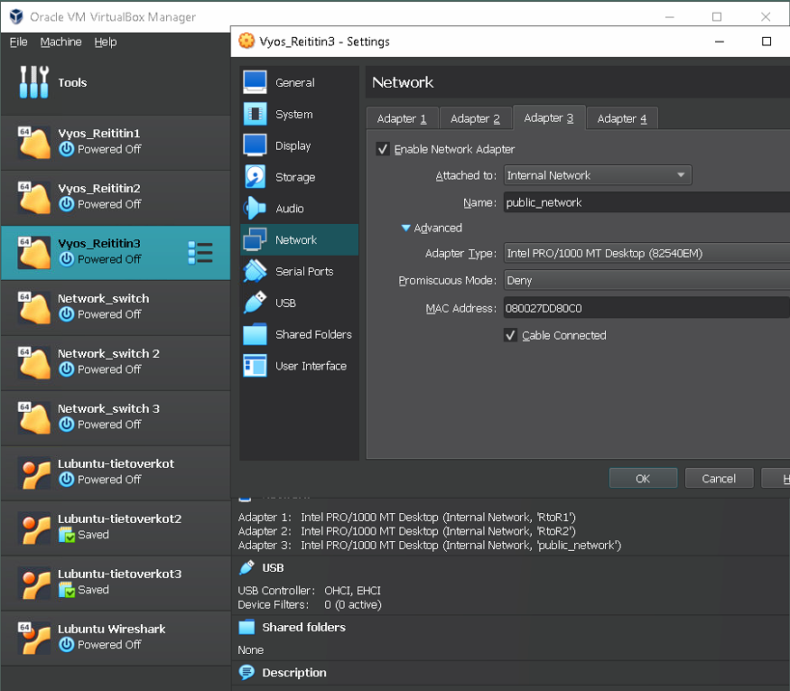
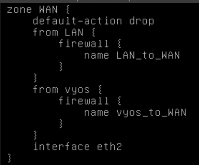
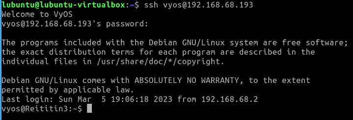

# Dokumentaatio tehtävään E09

<h2>Palomuuri</h2>

<h2>FYYSINEN TOPOLOGIA<h2>


<h2>LOOGINEN TOPOLOGIA</h2>


<h2>Aloitamme kopioimalla R2:n ja asetetaan kytkennät topologian mukaisesti</h2>




<h3>Luo 3 vyöhykettä R3:lla: LAN, WAN, vyos</h3>


<h3>Konfiguroi palomuuriasetukset R3:lle</h3>





<p>Testataan yhteys Lubuntu 4 -> Vyos 3</p>


<p>Minulla oli pitkään ongelmana, etten saannut pingiä LAN -> Lubuntu 4, unohtui pikku protokolla välistä</p>


<p>Ja hurraa, ping kulkee!</p>


<p>Pääsemme kanssa SSH yhteydellä Vyos3 sisään</p>



<h2>Vyos3 konfiguraatio</h2>

````
vyos@Reititin3:~$ show configuration 
firewall {
    all-ping enable
    broadcast-ping disable
    config-trap disable
    ipv6-receive-redirects disable
    ipv6-src-route disable
    ip-src-route disable
    log-martians enable
    name LAN_to_WAN {
        default-action drop
        enable-default-log
        rule 10 {
            action accept
            destination {
                port 80
            }
            log enable
            protocol tcp
        }
        rule 11 {
            action accept
            destination {
                port 443
            }
            log enable
            protocol tcp
        }
        rule 20 {
            action accept
            log enable
            protocol icmp
        }
        rule 30 {
            action accept
            destination {
                port 22
            }
            log enable
            protocol tcp
        }
        rule 40 {
            action accept
            destination {
                port 53
            }
            log enable
            protocol udp
        }
    }
    name LAN_to_vyos {
        default-action drop
        rule 10 {
            action accept
            destination {
                port 22
            }
            protocol tcp
        }
        rule 20 {
            action accept
            protocol ospf
        }
    }
    name WAN_to_LAN {
        default-action drop
        rule 10 {
            action accept
            state {
                established enable
                related enable
            }
        }
    }
    name WAN_to_vyos {
        default-action drop
        rule 10 {
            action accept
            state {
                established enable
                related enable
            }
        }
        rule 20 {
            action accept
            protocol icmp
        }
    }
    name vyos_to_LAN {
        default-action drop
        rule 10 {
            action accept
            state {
                established enable
                related enable
            }
        }
        rule 20 {
            action accept
            protocol ospf
        }
    }
    name vyos_to_WAN {
        default-action drop
        rule 10 {
            action accept
            state {
                established enable
                related enable
            }
        }
    }
    receive-redirects disable
    send-redirects enable
    source-validation disable
    syn-cookies enable
    twa-hazards-protection disable
}
interfaces {
    ethernet eth2 {
        address 192.168.68.193/26
        description public_network
        duplex auto
        hw-id 08:00:27:dd:80:c0
        smp-affinity auto
        speed auto
    }
    ethernet eth3 {
        address 10.5.52.245/30
        description RtoR2
        duplex auto
        hw-id 08:00:27:89:95:fa
        ip {
            ospf {
                authentication {
                    md5 {
                        key-id 1 {
                            md5-key ****************
                        }
                    }
                }
                dead-interval 40
                hello-interval 10
                priority 1
                retransmit-interval 5
                transmit-delay 1
            }
        }
        smp-affinity auto
        speed auto
    }
    ethernet eth4 {
        address 10.5.52.250/30
        description RtoR1
        duplex auto
        hw-id 08:00:27:36:b5:36
        ip {
            ospf {
                authentication {
                    md5 {
                        key-id 1 {
                            md5-key ****************
                        }
                    }
                }
                dead-interval 40
                hello-interval 10
                priority 1
                retransmit-interval 5
                transmit-delay 1
            }
        }
        smp-affinity auto
        speed auto
    }
    loopback lo {
        address 10.5.52.242/32
        description loopback
    }
}
protocols {
    ospf {
        area 0 {
            authentication md5
            network 10.5.52.248/30
            network 10.5.52.244/30
            network 10.5.52.242/32
            network 192.168.68.192/26
        }
    }
    static {
    }
}
service {
    dhcp-server {
        shared-network-name public_network {
            subnet 192.168.68.192/26 {
                default-router 192.168.68.193
                range PCs {
                    start 192.168.68.194
                    stop 192.168.68.243
                }
            }
        }
    }
    ssh {
        port 22
    }
}
system {
    config-management {
        commit-revisions 200
    }
    console {
        device ttyS0 {
            speed 9600
        }
    }
    host-name Reititin3
    ntp {
    }
    time-zone UTC
}
zone-policy {
    zone LAN {
        default-action drop
        from WAN {
            firewall {
                name WAN_to_LAN
            }
        }
        from vyos {
            firewall {
                name vyos_to_LAN
            }
        }
        interface eth3
        interface eth4
    }
    zone WAN {
        default-action drop
        from LAN {
            firewall {
                name LAN_to_WAN
            }
        }
        from vyos {
            firewall {
                name vyos_to_WAN
            }
        }
        interface eth2
    }
    zone vyos {
        default-action drop
        from LAN {
            firewall {
                name LAN_to_vyos
            }
        }
        from WAN {
            firewall {
                name WAN_to_vyos
            }
        }
        local-zone
    }
}
vyos@Reititin3:~$ 
````

<h2>Opsf</h2>

````
vyos@Reititin3# show protocols ospf
 area 0 {
     authentication md5
     network 10.5.52.248/30
     network 10.5.52.244/30
     network 10.5.52.242/32
     network 192.168.68.192/26
 }
[edit]
vyos@Reititin3# 
````


<h2>Wireshark</h2>

<h3>Lubuntu1 -> Lubuntu4</h3>


<p>Huomaamme Wiresharkilla kuunnellessa yhteyttä, 192.168.68.2 (Lubuntu1) lähettää paketteja 192.168.68.194 (Lubuntu4) ja L4 vastaa näihin. (Tässä kuvassa yksipuolinen ping)
ARP kyselee samalla, kenelle .193 päätteinen fyysinen IP-osoite kuuluu, johon saadaan vastaukseksi Reitittimen mac-osoite</p>


<h3>Lubuntu4 -> Lubuntu3</h3>


<p>Kuvassa huomataan L4 lähettävän paketteja, mutta palomuurin asetusten ansiosta, emme pääse julkisesta verkosta pingaamaan sisään LAN verkon alaisuudessa oleville päätelaitteille</p>

<h3>Lubuntu1 <-> Lubuntu4</h3>


<p>Sama toteutus, kuin edellisessä eriteltynä, mutta nyt L1 ja L4 lähettävät paketteja ristiin</p>