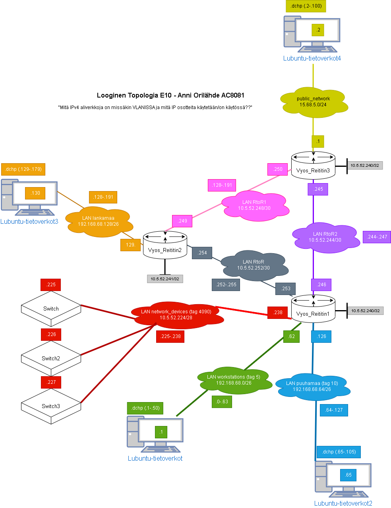
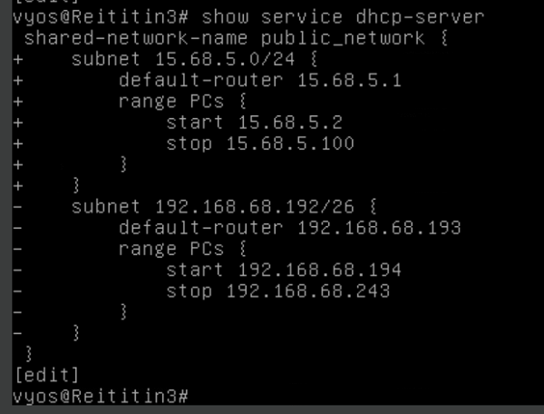
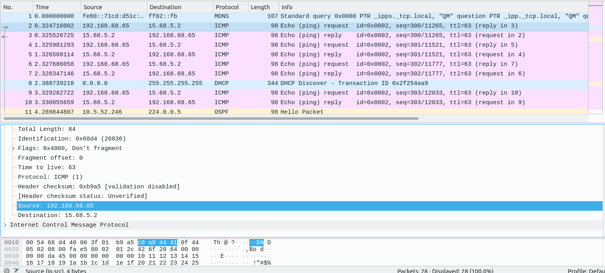
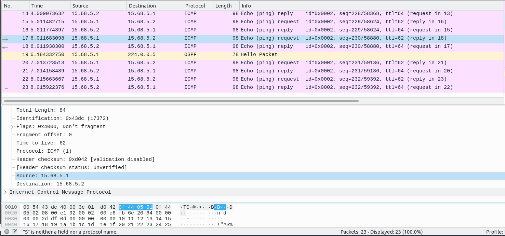

# Dokumentaatio tehtävään E10


<h2>LOOGINEN TOPOLOGIA</h2>



<h2>Lubuntu4 IP-julkiselle puolelle</h2>



<p>Huomasin, etten onnistunut melkein tässä tehtävässä, koska "julkisella puolella" olevan
Lubuntu4 IP-osoite sekoitti NAT asetuksia</p>
<p>Kuvakaappauksessa muutos DCHP asetuksille, jossa julkisen verkon
IP-osoitetta 15.68.5.0/24 jaetaan vain 100 IP osoitteen verran.</p>


<h2>Vyos3</h3>

````
vyos@Reititin3# show interfaces
 ethernet eth2 {
     address 15.68.5.1/24
     description public_network
     duplex auto
     hw-id 08:00:27:dd:80:c0
     smp-affinity auto
     speed auto
 }
 ethernet eth3 {
     address 10.5.52.245/30
     description RtoR2
     duplex auto
     hw-id 08:00:27:89:95:fa
     ip {
         ospf {
             authentication {
                 md5 {
                     key-id 1 {
                         md5-key **************
                     }
                 }
             }
             dead-interval 40
             hello-interval 10
             priority 1
             retransmit-interval 5
             transmit-delay 1
         }
     }
     smp-affinity auto
     speed auto
 }
 ethernet eth4 {
     address 10.5.52.250/30
     description RtoR1
     duplex auto
     hw-id 08:00:27:36:b5:36
     ip {
         ospf {
             authentication {
                 md5 {
                     key-id 1 {
                         md5-key ***************
                     }
                 }
             }
             dead-interval 40
             hello-interval 10
             priority 1
             retransmit-interval 5
             transmit-delay 1
         }
     }
     smp-affinity auto
     speed auto
 }
 loopback lo {
     address 10.5.52.242/32
     description loopback
 }
vyos@Reititin3# 

vyos@Reititin3# show protocols 
 ospf {
     area 0 {
         authentication md5
         network 10.5.52.248/30
         network 10.5.52.244/30
         network 10.5.52.242/32
         network 15.68.5.0/24
     }
 }
 static {
 }
````

<h3>NAT</h3>

````
vyos@Reititin3# show nat
 source {
     rule 10 {
         description "pass traffic to the internet"
         outbound-interface eth2
         protocol all
         source {
             address 192.168.68.0/24
         }
         translation {
             address masquerade
         }
     }
     rule 20 {
         outbound-interface eth2
         protocol all
         source {
             address 10.5.52.0/24
         }
         translation {
             address masquerade
         }
     }
 }
[edit]
vyos@Reititin3# 

````

<h3>Show komennoilla toimivuus</h3>

<p>Tämän show komennon tein molemmin päin, jossa pingasin ristiin L2 ja L4.</p>
<p>Huomaamme L2 (.65) lähtevän osoitteen muuttuvan (.1) päätteiseksi NATin jälkeen.</p>

````
vyos@Reititin3:~$ show nat source translations 
Pre-NAT              Post-NAT             Prot  Timeout 
15.68.5.2            15.68.5.2            icmp  29      
192.168.68.65        15.68.5.1            icmp  29      
vyos@Reititin3:~$ show nat source translations 
Pre-NAT              Post-NAT             Prot  Timeout 
15.68.5.2            15.68.5.2            icmp  29      
192.168.68.65        15.68.5.1            icmp  29      
vyos@Reititin3:~$ 
````

<h2>Wireshark: NAT</h2>

<h3>Wireshark - RtoR2 (Sisäverkko)</h3>



<p>Tässä huomaamme Lubuntu2 (.65) lähettävän pingejä sisäverkon puolelta julkisen puolen Lubuntu4 (.2) osoitteeseen</p>

<h3>Wireshark - public_network (Ulkoverkko)</h3>



<p>Tässä huomaamme Lubuntu2 pingin saapuvan Vyos3 IP-osoitteesta (.1) osoitteeseen (.2)</p>


