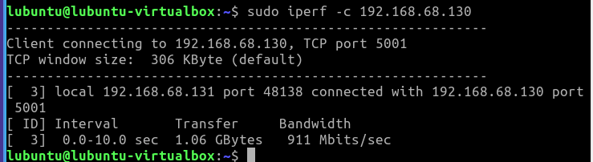
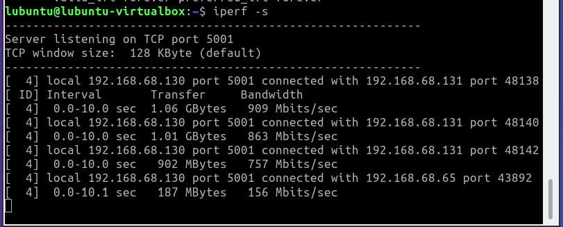

# Dokumentaatio tehtävään E11

<h2>IPERF</h2>

<h3>Testi kodista internettiin</h3>

Vaihdetaan internal network -> bridged network. Huomaamme, että saamme
uuden IP osoitteen Lubuntu3:lle

Tämä oli ainut iperf yhteys, johon sain yhteyden

Otamme yhteyden clienttina kyseiseen iperf -palvelimelle, TCP portin 5001 kautta. 
Lähetämme 10 sekunnin aikana dataa 58.4 megatavun verran. Kolmannessa sarakkeessa on kuinka suuri paketti lähtee 
sekunnissa, joka on 48.6 megabittiä/sec.

<h3>Testi harjoitusympäristössä</h3>

Asetamme Lubuntu3 iperf -serveriksi.

Lubuntu2 laitetaan clientiksi ja aloitamme testaamaan lähettämällä paketteja 
Lubuntu3

Vastaanotto näyttää tältä ja yhteys toimii!

Testatkaamme eri komentoja

Lubuntu3 puolelta lähetykset näyttää tältä

<h4>Pohdintaa</h4>

<h2>Tutki TCP/UDP yhteyksiä</h2>

Saamme asiakaslubuntulla (Lubuntu2) yhteyden serverille (Lubuntu3)

<h3>Handshake</h3>

Alla kuvakaappauksia eri paketeista.

Kaikki paketit

Handshake paketin sain napattua, kun klikkasin verkkosivulla olevaa linkkiä manuaalisivuille, tcp paketeista näemme 
destination portin "80" - joka vastaa http-protokollaa. Lähetämme klikkauksella pyynnön tcp-palvelimelle, 
joka vastaa lähettämällä pyyntöön sopivan vastauksen (html-sivu)

<h3>DHCP</h3>

Kaikki paketit

Käytännössä näemme, kun Lubuntu2 käynnistyessä, päätelaite lähtee hakemaan
itselleen yhteyttä, mutta ei osaa identifioitua. Kytkin tunnistaa huhuilun ja tarjoaa päätelaitteen porttiin asetettua osoitetta
laitteelle, jonka laite ottaa ilomielin vastaan. DCHP protokolla määrää protokollalle määrätyn ip-osoitteen osoiteavaruudesta.
