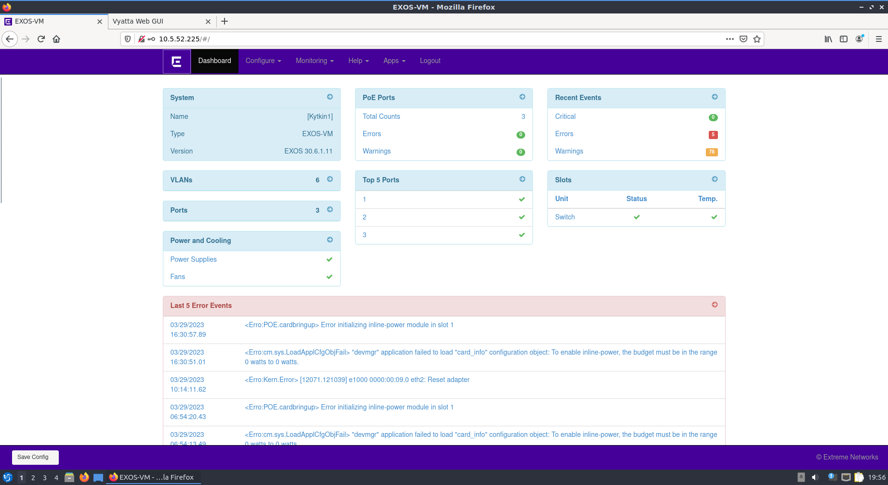
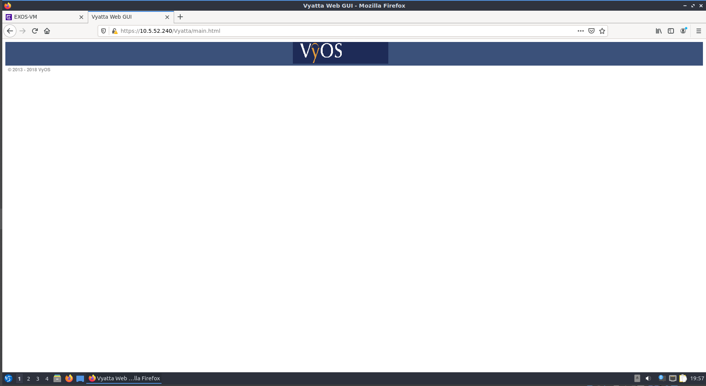
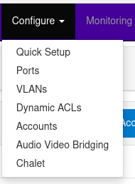

# Dokumentaatio tehtävään E12

<h2>Konfiguraation hallinta</h2>

<h3>Konfiguraatiot</h2>
<h3>EXos - Kytkin</h3>

[EXos1](./E12/E12-Switch.cfg) 
[EXos2](./E12/E12-Switch2.cfg) 
[EXos3](./E12/E12-Switch3.cfg) 

<h3>Vyos - Reititin</h3>

[Vyos1](./E12/E12-Vyos_Reititin1.cfg) 
[Vyos2](./E12/E12-Vyos_Reititin2.cfg) 
[Vyos3](./E12/E12-Vyos_Reititin3.cfg) 

<h2>Testataan HTTP vyos ja switch</h2>

Laitan Switch (Kytkin1) ja Vyos_Reititin1 HTTP palvelimen päälle ja testataan toimivuus Lubuntu2

<h3>Kysymys: Mitä voin konfiguroida selaimen kautta?</h3>

Selaimen kautta pääset yksinkertaisemmin ja helpommin konfiguroimaan mm. portit päälle/pois päältä,
VLAN yhteyksiä ja niiden erityisasetuksia. Samoin käyttäjiä voit luoda Accounts osiossa ja ACL suom Käyttäjäoikeuslista,
voit rajata eri tilien oikeuksia. Kaikkien ei välttämättä tarvitse päästä muokkaamaan asetuksia Adminin tavoin.
