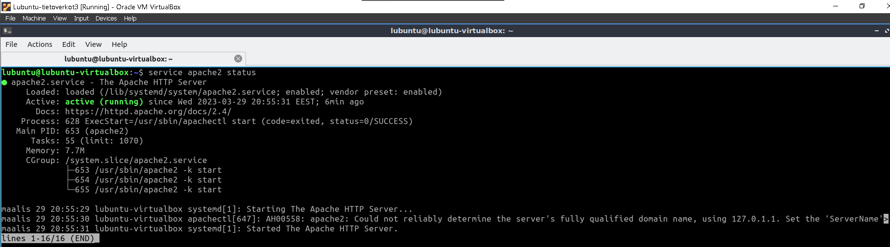
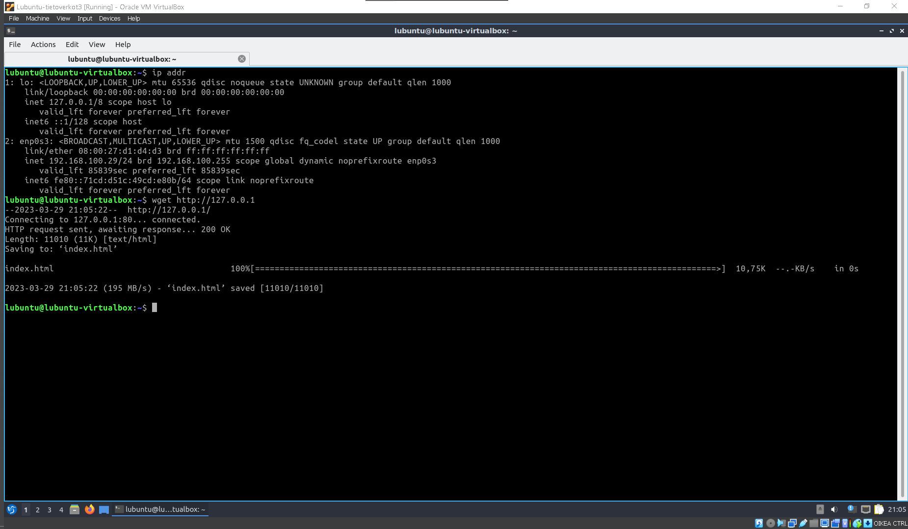
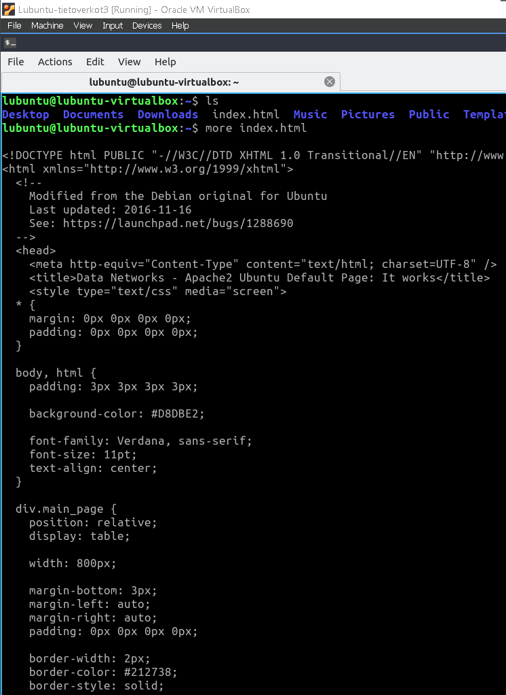
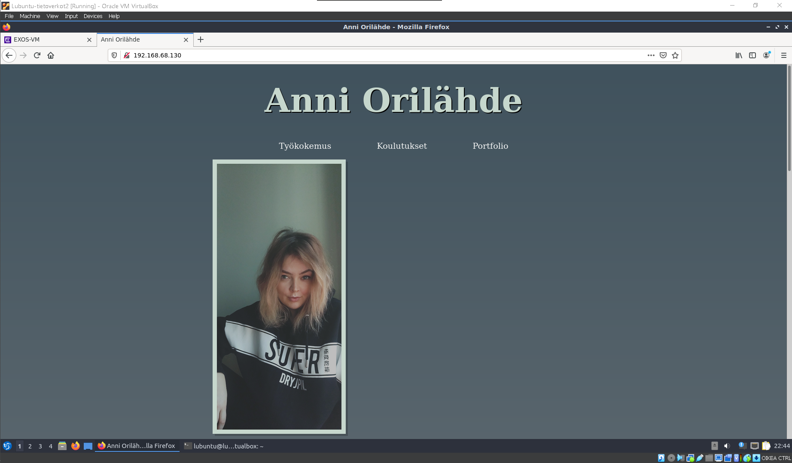
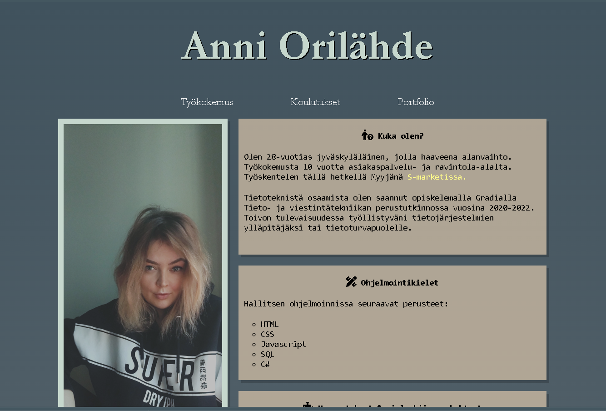
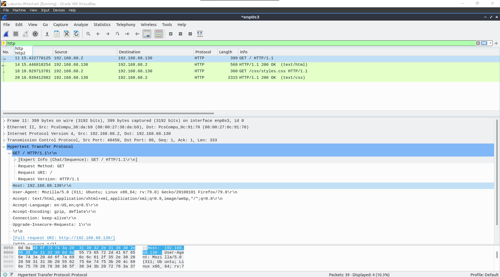
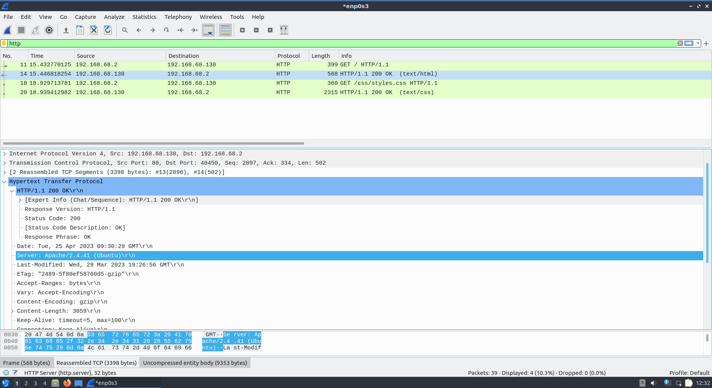

# Dokumentaatio tehtävään E13

<h2>Apache</h2>

<h3>Konfiguraatiot</h2>
<h3>EXos - Kytkin</h3>

[EXos1](./E12/E12-Switch.cfg) 
[EXos2](./E12/E12-Switch2.cfg) 
[EXos3](./E12/E12-Switch3.cfg) 

<h3>Vyos - Reititin</h3>

[Vyos1](./E12/E12-Vyos_Reititin1.cfg) 
[Vyos2](./E12/E12-Vyos_Reititin2.cfg) 
[Vyos3](./E12/E12-Vyos_Reititin3.cfg) 

Tarkistetaan Apache2 toimivuus

wget komentoa....

Tarkastetaan, mitä index.html sisältä löytyy

Sudo nanotin index.html tiedoston /var/www/html/ -kansiossa ja drop & draggasin virtuaalikoneen työpöydälle
halutut tiedostot, jotka lopuksi siirsin Linuxin terminaalista oikeaan repositorioon.

Huomaan, ettei kuvan asetukset mene virtuaalikoneessa kohilleen verrattuna näkymään omalta näytöltä:

<h1>TÄYDENNYS</h1>
<h2>Pahoittelut, tärkein jäi puuttumaan</h2>

<h3>Wireshark HTTPGET</h3>

Suodatin taas HTTPGET lähetykset Wiresharkilla, joka oli liitetty Lubuntu1-Lubuntu3 RtoR yhteyden väliin. Ensimmäisessä kuvassa näemme, kun pyydämme Lubuntu1 (.2) selaimen kautta yhteydelle HTTP lubuntu3 (.130) Apache serveriltä yhteyslupaa. Toisella rivillä (Kuva 2) saamme luvan ja palvelin lähettää vastaukseksi selaimeen palvelimelle tallennettu html - koodilla ohjelmoitu verkkosivun näkymän. 3. ja 4. rivillä pyydetään vielä tyylit palvelimelta näkyville.
