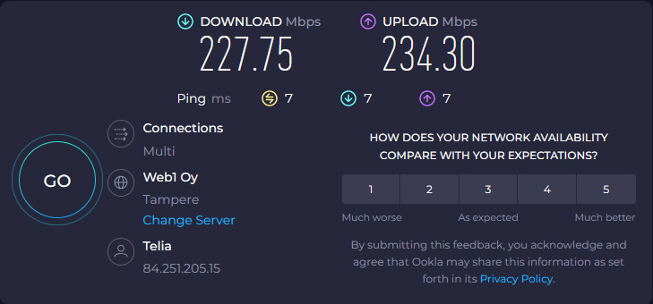
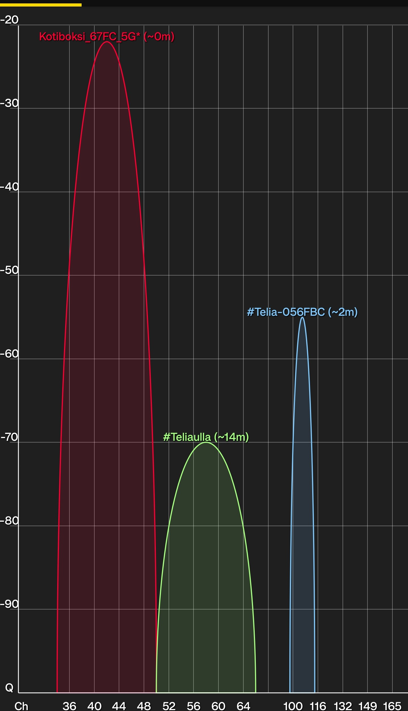
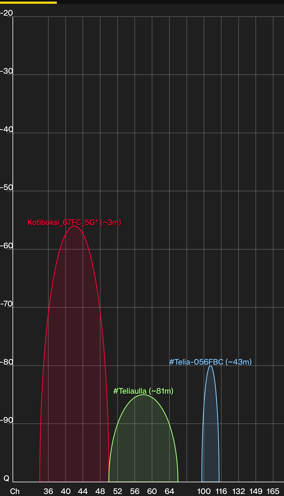
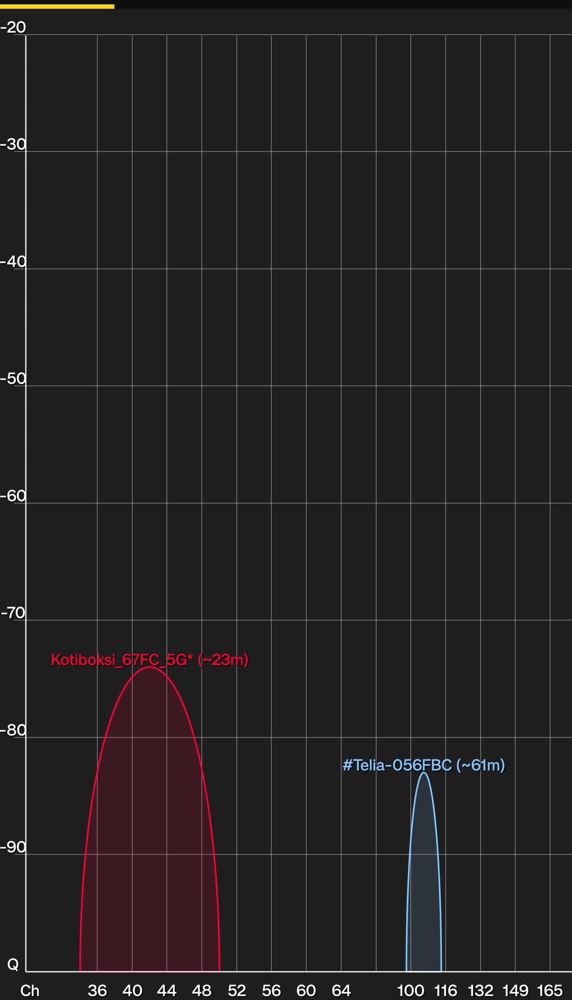
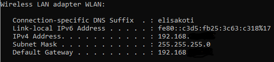
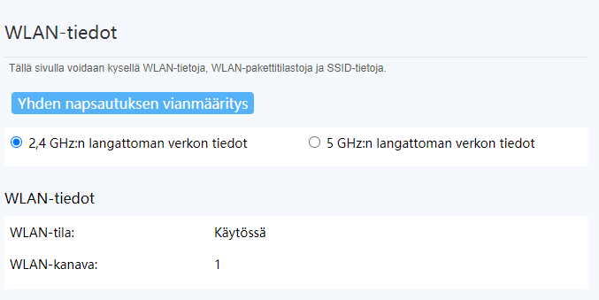
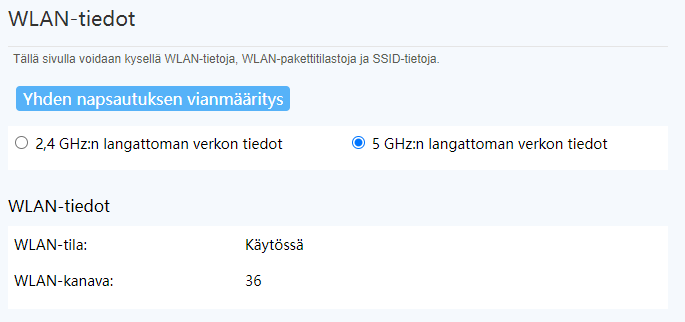
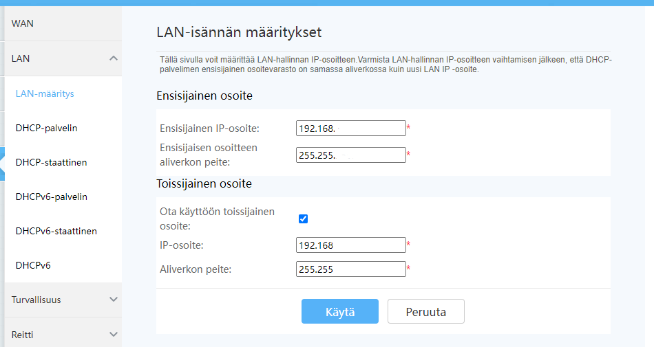
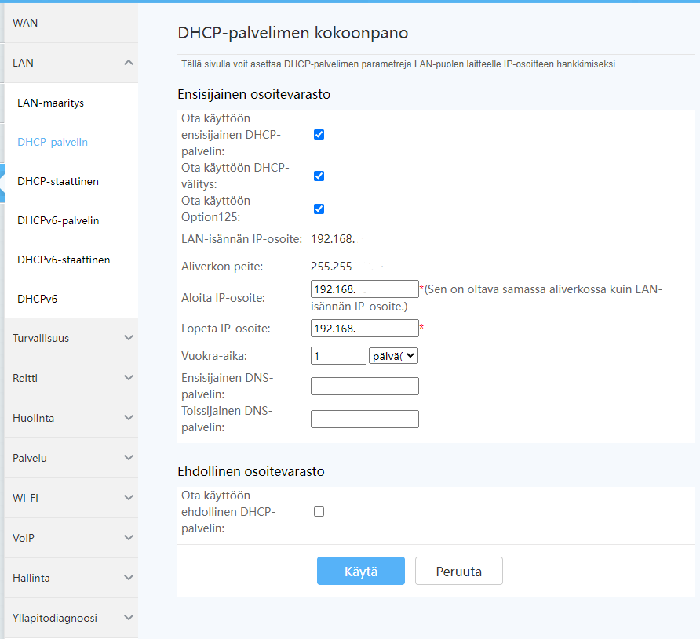

# Dokumentaatio tehtävään E14

<h2>OPTION 2 -WLAN--analysaattorilla kotiverkon & hotspot -tukiaseman tutkimusta</h2>

<h3>Tutki kotisi WLANia (tai läheisiä WLANeja)</h3>

Speedtest by Ookla: Miehen tietokone, joka on suoraan kiinni reitittimessä

Oma tietokone toisessa huoneessa (välissä olohuone)

<h3>Käytä WLAN analysaattoria tutkimaan kanavien käyttöasteita</h3>

Reitittimen lähellä

Olohuone

Oman tietokoneen äärellä

<h3>Ota yhteyttä WLAN tukiaseman hallintapaneeliin LAN portin kautta (tai matkapuhelimella)</h3>

<em>Mikä on oletusyhdyskäytävä laitteille, jotka ovat WLAN:ssa tai LAN:ssa kiinni?</em>

<h3>Tutkitaan WLAN-tukiasemaa</h3>

<em>Mikä kanava? Voiko sitä muuttaa "vapaampaan" kanavaan (perustuen kohdan 1. löydöksiin)?</em>

Pystyn vaihtamaan eri taajuksien asetuksien puolelle, mutta en äkkiseltään löytänyt erillistä "kanava" -asetusta. Alla kuvat 2,4GHz ja 5GHz WLAN-kanavista.

<em>Mikä on aliverkkosi? Voiko sitä muuttaa?</em>

<em>Mikä on DHCP palvelin? Voiko sitä muuttaa/säätää?</em>

<em>Mitä muita WLAN asetuksia voidaan säätää?</em>

Monipuolinen asetusvalikko, kurssilla opittujen asioiden lisäksi (LAN-aliverkotus, DCHP, DNS, IPv4/6 yms) pystyn asetuksista määrittämään mm; 
- liitettyjen laitteiden määrää 
- estämään laitteita yhdistymästä verkkoon 
- laitteen porttien asetuksia 

