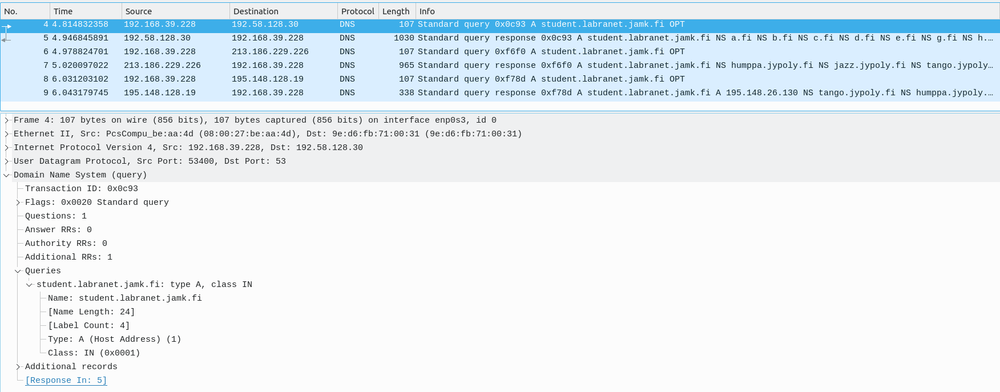
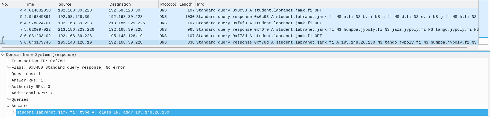
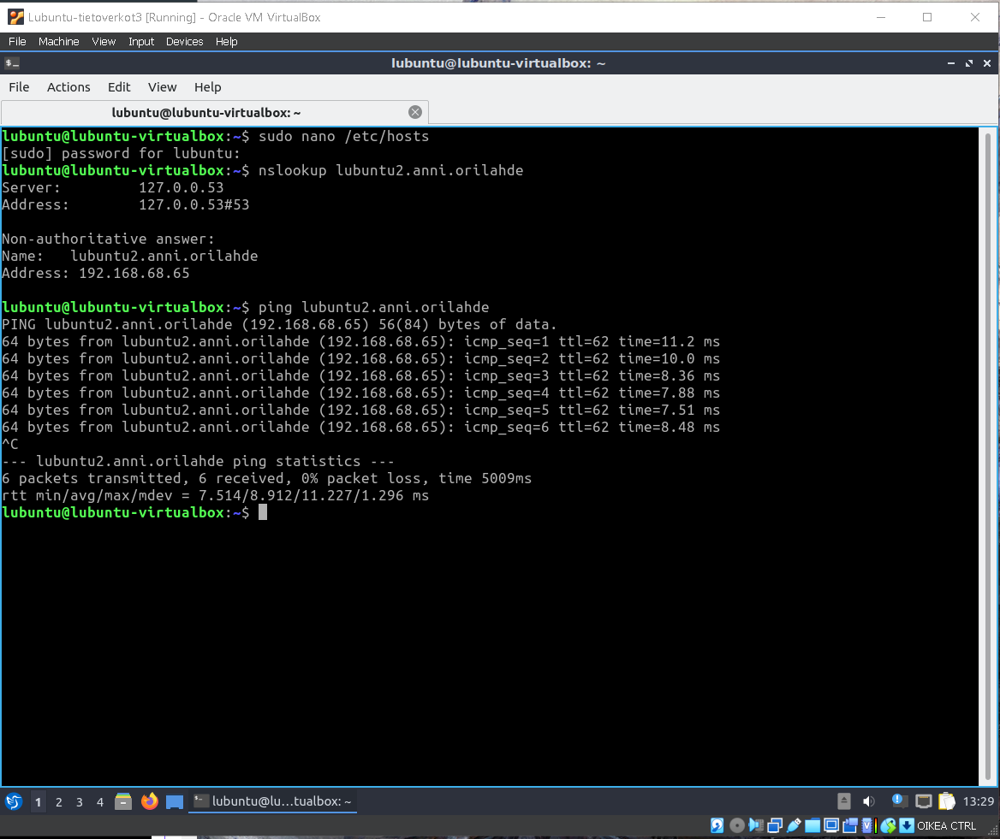
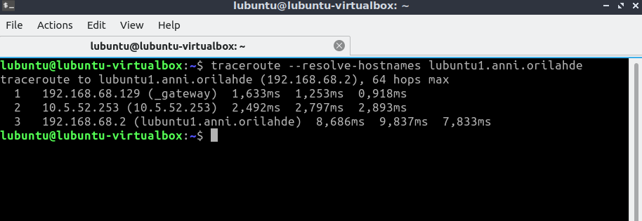
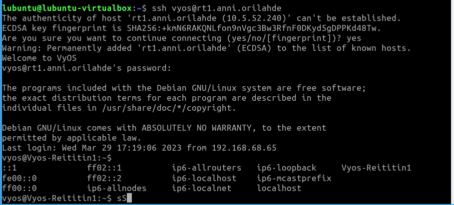

# Dokumentaatio tehtävään E15

<h2>ASKEL 1 - DNS Internetissä</h2>


<h3>Tallenna dig +trace -komennon tuloste</h3>

````
lubuntu@lubuntu-virtualbox:~$ dig +trace student.labranet.jamk.fi

; <<>> DiG 9.16.1-Ubuntu <<>> +trace student.labranet.jamk.fi
;; global options: +cmd
.                       499579  IN      NS      k.root-servers.net.
.                       499579  IN      NS      l.root-servers.net.
.                       499579  IN      NS      m.root-servers.net.
.                       499579  IN      NS      a.root-servers.net.
.                       499579  IN      NS      b.root-servers.net.
.                       499579  IN      NS      i.root-servers.net.
.                       499579  IN      NS      g.root-servers.net.
.                       499579  IN      NS      f.root-servers.net.
.                       499579  IN      NS      j.root-servers.net.
.                       499579  IN      NS      d.root-servers.net.
.                       499579  IN      NS      e.root-servers.net.
.                       499579  IN      NS      h.root-servers.net.
.                       499579  IN      NS      c.root-servers.net.
;; Received 262 bytes from 127.0.0.53#53(127.0.0.53) in 124 ms

fi.                     172800  IN      NS      a.fi.
fi.                     172800  IN      NS      h.fi.
fi.                     172800  IN      NS      c.fi.
fi.                     172800  IN      NS      d.fi.
fi.                     172800  IN      NS      e.fi.
fi.                     172800  IN      NS      g.fi.
fi.                     172800  IN      NS      b.fi.
fi.                     172800  IN      NS      i.fi.
fi.                     172800  IN      NS      k.fi.
fi.                     172800  IN      NS      j.fi.
fi.                     86400   IN      DS      54049 8 2 924E552F60CBC5AA2517D0F59D658B119F211113E9A98F34402396EC 8A96A2D1
fi.                     86400   IN      RRSIG   DS 8 1 86400 20230418050000 20230405040000 60955 . Kq9hbedrbbkVC/WJ+dIYgq99VQznFMegxmxHwUKnMLI+ik0XYuIYGsJY UEPsJBqjA5yltT+UoxEmynG9hxhEO4v+uVMwnHsaSFJHKrTaYY5Cs7Oh 0FMo74SNj6onVO+T2ZImnpySccxSdHXVeTXp+Li4ejsUU7nL+S0pZKVb cv2mR16TiTjgCM2wUo6ZEwwwhJGO2ZAWBGlRohEUtOz20CvlOkH74qna gCWZUSfDr/jNvfH6fdwpSbT9DUUt6d+SX7inSvVYJrUU5O0p1Ui153DD XyM6bVEHbdGEQOac9ieBaBsG6FvU/QNH6s3KgFN8480nByrVbGQiZysn BSBSRQ==
;; Received 988 bytes from 192.5.5.241#53(f.root-servers.net) in 16 ms

jamk.fi.                21600   IN      NS      jazz.jypoly.fi.
jamk.fi.                21600   IN      NS      humppa.jypoly.fi.
jamk.fi.                21600   IN      NS      tango.jypoly.fi.
chi6upcrbq8caq0frfp92mdm0fmrca1l.fi. 86400 IN NSEC3 1 1 5 FD26A7FB6756E08A CHI7369JOL4SG6KNTAV5IS581ECO15RO NS SOA TXT RRSIG DNSKEY NSEC3PARAM
chi6upcrbq8caq0frfp92mdm0fmrca1l.fi. 86400 IN RRSIG NSEC3 8 2 86400 20230416123326 20230402062618 63286 fi. xbv4ss8O5jXCDwRDXm9YH/1t+K71FzLaPZHIZLcjdYKI1Ly2fFnnSuFV kZ+qzZFylbOI4gj1zYElOYTLB/Pn4HH0nQ5P67Zpv/TfjBHtuSPSm9wF lC5BeE/rWhRNeDziMM5A9AL08sD/Wf3jWSxbjX33xrCe44YKVueyyl8V j7gmZ1RMF4/sh9RytEQ6xA7I14y9NTai6UjMTpZN49Q3Z1o2owSlz/AD 4eduPTIti3Hk6C69izO+egSdZ4JsXfWtpfJf/M9i1kf5X3KFYusGrH6p 2jXyNn38oaj4XLYnXQK5eR28lq9utBDt6cfBteHkHf3Tqyyti3S3ODuU wLeMPQ==
voi5ccsqmsc2gmpumhled4607m72guo0.fi. 86400 IN NSEC3 1 1 5 FD26A7FB6756E08A VOJR1PJ46NLVA4EHVOCOIJS2H04BV8IG NS DS RRSIG
voi5ccsqmsc2gmpumhled4607m72guo0.fi. 86400 IN RRSIG NSEC3 8 2 86400 20230416014958 20230402062618 63286 fi. Bx40cRW+IY7YDt2M1d0RPdeooF0PBxzi/1qcCvuppzMG57agr1KrMedl 1hIyiCxX5o0ORnCpMMjRmcEII/66M1H+9UHLk86ZV3Y2sZtIA16oEHsq z9/ogNrsgUd35t81XqEmKEensMpZ0939W0DGXTaxGQxPzHUQuQW2mHZi bPNjCI4XRC9P1S1GXxeVXiugjo8/E2P3SBNQkG2lIdYpfdYeYtHdI0oT mG+ObSSV6zVowKwJM04PwLmdw4uKlPCKUdSHlzFa1P0JuEFHMkq8aEqo 9duExyy+nSpFcdWfeeT40J1NZOKyGlLX7Jj30Gr/+gwVZmGxJgq/JQkO aMx3lQ==
;; Received 932 bytes from 194.0.25.30#53(i.fi) in 60 ms

student.labranet.jamk.fi. 60    IN      A       195.148.26.130
jamk.fi.                86400   IN      NS      tango.jypoly.fi.
jamk.fi.                86400   IN      NS      humppa.jypoly.fi.
jamk.fi.                86400   IN      NS      jazz.jypoly.fi.
;; Received 296 bytes from 62.204.28.57#53(tango.jypoly.fi) in 32 ms

lubuntu@lubuntu-virtualbox:~$ 
````

<h3>Kuvakaappaus wireshark:n dig +trace -komennosta</h3>





<p>Ensimmäisessä kuvassa kaikki dns paketit suodatettuna. Riveillä näkyy kaikki kyselyt eri muodossa mitä saimme Terminaalista näkyviin. Toisessa kuvassa huomaamme saavamme vastauksen student.labranet.jamk.fi:n osoitteesta (195.148.26.130)</p>

<h2>ASKEL 2 - DNS topologiassa</h2>

Vaihda Lubuntu virtuaalikone oikeaan sisäiseen verkkoon (eng. internal network) topologiassasi
Tarkasta että työasemasi saa IPv4 osoitteen
Komentokehoitteessa editoi /etc/hosts (esim. sudo nano /etc/hosts)

<h3>Alla kopio, mitä nanotettu hosts -tiedostoon jokaiselle päätelaitteelle</h3>

````
lubuntu@lubuntu-virtualbox:~$ more /etc/hosts
# Host addresses
192.168.68.2 lubuntu1.anni.orilahde
192.168.68.65 lubuntu2.anni.orilahde
192.168.68.130 lubuntu3.anni.orilahde
15.68.5.2 lubuntu4.anni.orilahde
10.5.52.225 sw1.anni.orilahde
10.5.52.226 sw2.anni.orilahde
10.5.52.227 sw3.anni.orilahde
10.5.52.240 rt1.anni.orilahde
10.5.52.241 rt2.anni.orilahde
10.5.52.242 rt3.anni.orilahde
127.0.0.1  localhost
127.0.1.1  lubuntu-virtualbox
::1        localhost ip6-localhost ip6-loopback
ff02::1    ip6-allnodes
ff02::2    ip6-allrouters
````

<h3>Testaukset</h3>



<h3>Traceroute</h3>



<em>Kirjoitin tiedostoon Switchien ja Reitittimien lo - osoitteet, olisi pitänyt oletettavasti lisätty yhdyskäytävien ip - jotta nimet olisivat esillä traceroutessa?</em>

<h3>SSH</h3>


