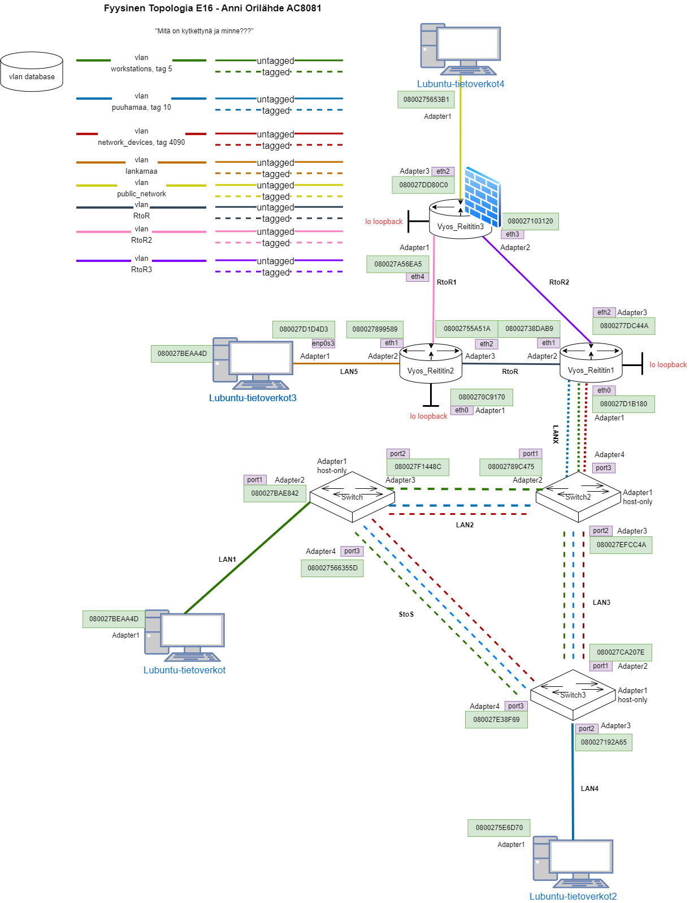
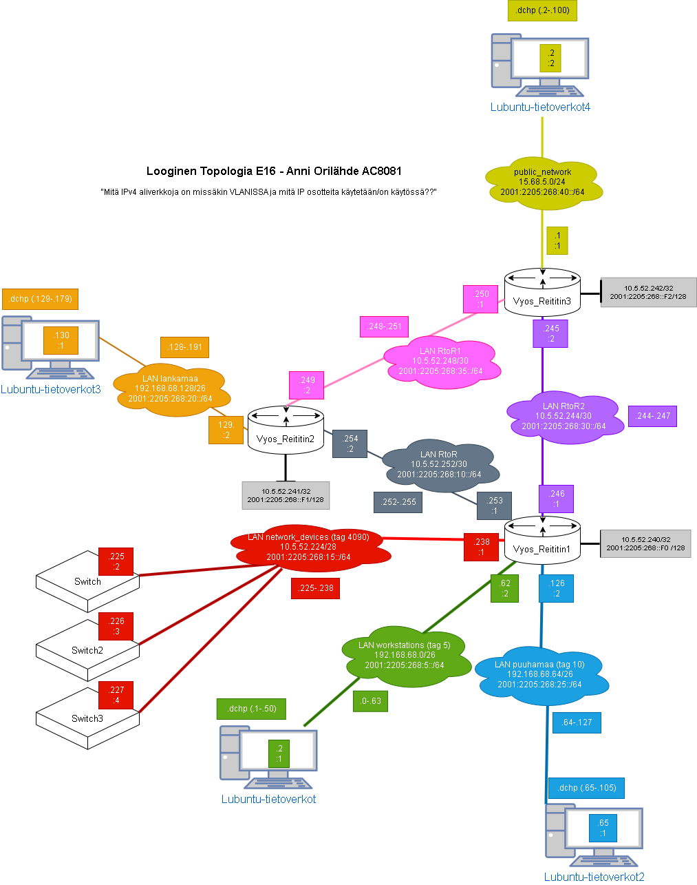
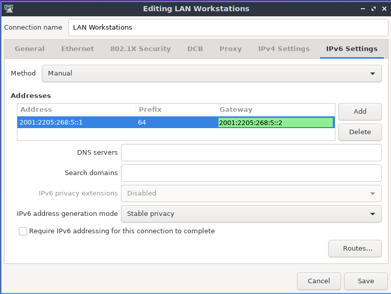
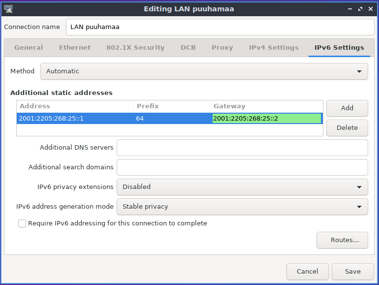
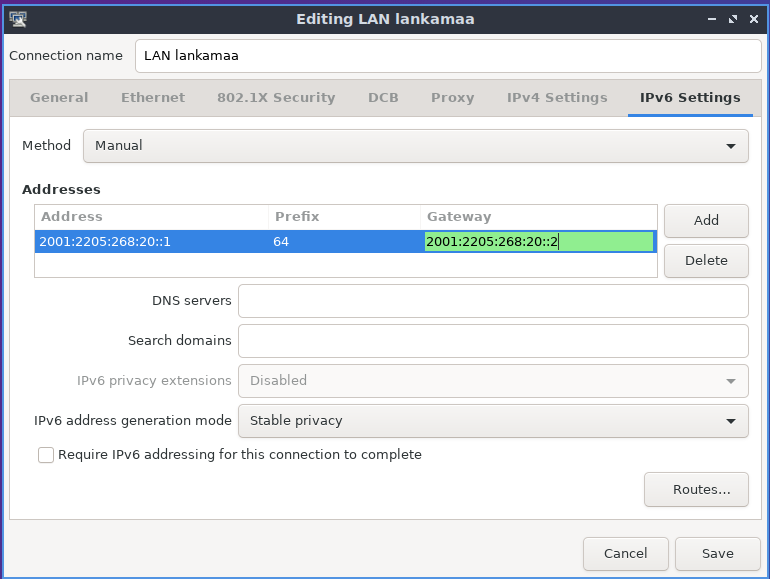
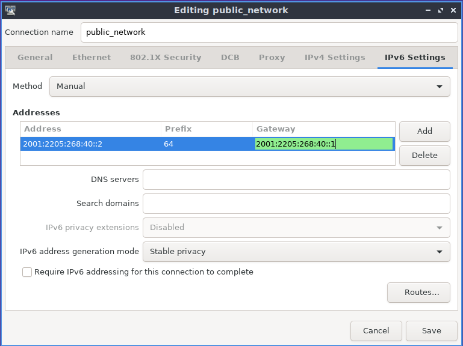
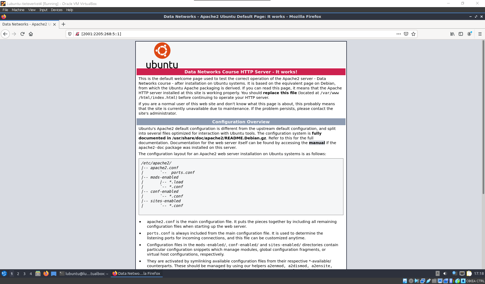

# Dokumentaatio tehtävään E16

<h2>DUAL STACK</h2>

<h3>Topologia</h3>




<h3>Konfiguraatiot</h2>
<h3>EXos - Kytkin</h3>

[EXos1](./E16/E16-Switch1.cfg)<br>
[EXos2](./E16/E16-Switch2.cfg)<br>
[EXos3](./E16/E16-Switch3.cfg)<br>

<h3>Vyos - Reititin</h3>

[Vyos1](./E16/E16-Vyos_Reititin1.cfg)<br>
[Vyos2](./E16/E16-Vyos_Reititin2.cfg)<br>
[Vyos3](./E16/E16-Vyos_Reititin3.cfg)<br>

<h3>Manuaalinen osotteistaminen</h3>






<p>Reitittimien kanssa meni säätämiseksi, kun olisin halunnut säilyttää palomuurin loppuun asti. (Materiaalissa oleva linkki, kuinka sallia ospfv3 ei toimi.)<br>
Suunnittelin aluksi osoitteet excelille, josta siirsin IPv6 osoitteet loogiseen topologiaan. Siitä oli helppo kattoa ja osotteistaa tutuilla komennoilla Reitittimet kuntoon.</p>

<h3>Testataan ympäristö</h3>

<h3>PING L4 -> KAIKKIIN MUIHIN LUBUNTUIHIN</h3>

````
lubuntu@lubuntu-virtualbox:~$ ping 2001:2205:268:25::1
PING 2001:2205:268:25::1(2001:2205:268:25::1) 56 data bytes
64 bytes from 2001:2205:268:25::1: icmp_seq=1 ttl=61 time=6.85 ms
64 bytes from 2001:2205:268:25::1: icmp_seq=2 ttl=61 time=5.21 ms
64 bytes from 2001:2205:268:25::1: icmp_seq=3 ttl=61 time=4.75 ms
64 bytes from 2001:2205:268:25::1: icmp_seq=4 ttl=61 time=3.77 ms
64 bytes from 2001:2205:268:25::1: icmp_seq=5 ttl=61 time=4.06 ms
^C
--- 2001:2205:268:25::1 ping statistics ---
5 packets transmitted, 5 received, 0% packet loss, time 4006ms
rtt min/avg/max/mdev = 3.765/4.925/6.849/1.087 ms
lubuntu@lubuntu-virtualbox:~$ ping 2001:2205:268:5::1
PING 2001:2205:268:5::1(2001:2205:268:5::1) 56 data bytes
64 bytes from 2001:2205:268:5::1: icmp_seq=1 ttl=61 time=4.14 ms
64 bytes from 2001:2205:268:5::1: icmp_seq=2 ttl=61 time=4.11 ms
64 bytes from 2001:2205:268:5::1: icmp_seq=3 ttl=61 time=5.00 ms
64 bytes from 2001:2205:268:5::1: icmp_seq=4 ttl=61 time=4.89 ms
64 bytes from 2001:2205:268:5::1: icmp_seq=5 ttl=61 time=5.15 ms
^C
--- 2001:2205:268:5::1 ping statistics ---
5 packets transmitted, 5 received, 0% packet loss, time 4005ms
rtt min/avg/max/mdev = 4.107/4.658/5.152/0.444 ms
lubuntu@lubuntu-virtualbox:~$ ping 2001:2205:268:20::1
PING 2001:2205:268:20::1(2001:2205:268:20::1) 56 data bytes
64 bytes from 2001:2205:268:20::1: icmp_seq=1 ttl=62 time=2.06 ms
64 bytes from 2001:2205:268:20::1: icmp_seq=2 ttl=62 time=2.19 ms
64 bytes from 2001:2205:268:20::1: icmp_seq=3 ttl=62 time=2.62 ms
64 bytes from 2001:2205:268:20::1: icmp_seq=4 ttl=62 time=1.64 ms
64 bytes from 2001:2205:268:20::1: icmp_seq=5 ttl=62 time=2.02 ms
^C
--- 2001:2205:268:20::1 ping statistics ---
5 packets transmitted, 5 received, 0% packet loss, time 4007ms
rtt min/avg/max/mdev = 1.642/2.106/2.622/0.316 ms
````

<h3>TRACEROUTE L4 -> KAIKKIIN MUIHIN LUBUNTUIHIN</h3>

<p>Merkitsen alla olevaan tracerouteen, mitä reittiä ping kulkee</p>

````
lubuntu@lubuntu-virtualbox:~$ traceroute6 2001:2205:268:5::1
traceroute to 2001:2205:268:5::1 (2001:2205:268:5::1) from 2001:2205:268:40::2, 30 hops max, 24 byte packets
 1  _gateway (2001:2205:268:40::1)  5,5808 ms  0,8651 ms  0,9691 ms <-- R3
 2  2001:2205:268:35::2 (2001:2205:268:35::2)  2,9878 ms  3,3236 ms  2,8882 ms <-- R2
 3  2001:2205:268:10::1 (2001:2205:268:10::1)  5,3870 ms  4,7725 ms  4,6471 ms <-- R1
 4  2001:2205:268:5::1 (2001:2205:268:5::1)  8,3833 ms  6,5195 ms  5,2964 ms <-- L1
lubuntu@lubuntu-virtualbox:~$ traceroute6 2001:2205:268:25::1
traceroute to 2001:2205:268:25::1 (2001:2205:268:25::1) from 2001:2205:268:40::2, 30 hops max, 24 byte packets
 1  _gateway (2001:2205:268:40::1)  0,9220 ms  0,8656 ms  0,7984 ms <-- R3
 2  2001:2205:268:35::2 (2001:2205:268:35::2)  1,7234 ms  2,5890 ms  0,8542 ms <-- R2
 3  2001:2205:268:10::1 (2001:2205:268:10::1)  2,7708 ms  2,8850 ms  2,2541 ms <-- R1
 4  2001:2205:268:25::1 (2001:2205:268:25::1)  5,5069 ms  4,4767 ms  6,9962 ms <-- L2
lubuntu@lubuntu-virtualbox:~$ traceroute6 2001:2205:268:20::1
traceroute to 2001:2205:268:20::1 (2001:2205:268:20::1) from 2001:2205:268:40::2, 30 hops max, 24 byte packets
 1  _gateway (2001:2205:268:40::1)  1,4552 ms  0,5306 ms  1,1759 ms <-- R3
 2  2001:2205:268:35::2 (2001:2205:268:35::2)  1,8004 ms  2,0739 ms  2,0059 ms <-- R2
 3  2001:2205:268:20::1 (2001:2205:268:20::1)  1,7724 ms  3,8524 ms  3,3747 ms <-- L3
lubuntu@lubuntu-virtualbox:~$ 

````

<h3>MOZILLA SELAIMELLA L4 http:// -> KAIKKIIN MUIHIN LUBUNTUIHIN</h3>




