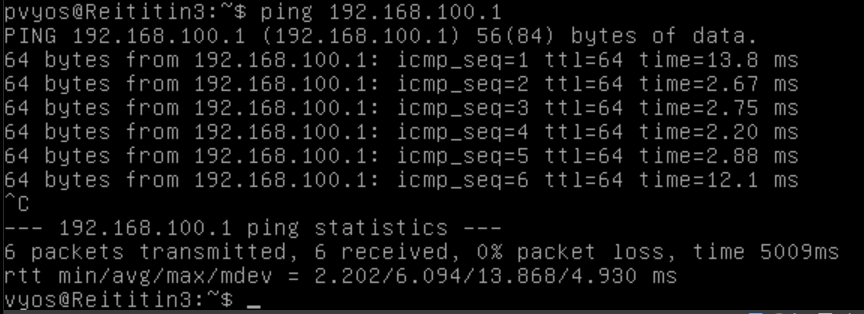
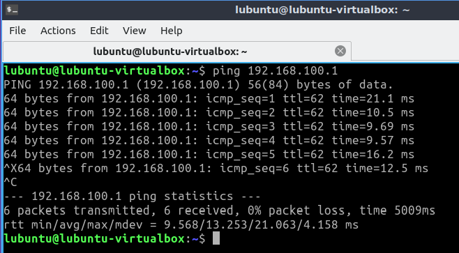

# Dokumentaatio tehtävään E17

<h2>Tervetuloa internettiin</h2>

<h3>Vaihtoehto 1 - Liitä topologia internettiin (IPv4)</h3>

<h3>Topologia</h3>


<h3>Konfiguraatiot</h2>
<h3>EXos - Kytkin</h3>

[EXos1](./E17/E17-Switch1.cfg)<br>
[EXos2](./E17/E17-Switch2.cfg)<br>
[EXos3](./E17/E17-Switch3.cfg)<br>

<h3>Vyos - Reititin</h3>

[Vyos1](./E17/E17-Vyos_Reititin1.cfg)<br>
[Vyos2](./E17/E17-Vyos_Reititin2.cfg)<br>
[Vyos3](./E17/E17-Vyos_Reititin3.cfg)<br>

<h3>Tutkitaan kotiverkkoa</h3>


<p>Huomaan heti 255.255.255.0 subnet maskista, että aliverkko on /24. oma laite on .11 päätteinen ja Reitittimen Default on .1</p>
<p>Valitsen R3 eth2 IPv4 osoitteeksi 192.168.100.2</p>

<h3>R3 Reititin</h3>

<p>Tarkistetaan R3 Interface</p>


<p> Lisätään eth2 rajapintaan address tutulla komennolla. (Kuvassa IP-osoite on puhelimen mukaan tehtynä)</p>


<h3>Päivitä DHCP serverille DNS asetukset</h3>

<p>R3 asetukset</p>


<p>Lisätään muille reitittimille(1 & 2) DNS protokolla aliverkkoihin. Alla kuvassa esimerkki lisätty LAN lankamaalle (LAN5)</p>


<h3>Yhteyden testaamista</h3>

<h3>R3 -> Kotireititin</h3>



<h3>Lubuntu1 -> Internet</h3>



````
lubuntu@lubuntu-virtualbox:~$ ping 192.168.100.1
PING 192.168.100.1 (192.168.100.1) 56(84) bytes of data.
64 bytes from 192.168.100.1: icmp_seq=1 ttl=62 time=6.55 ms
64 bytes from 192.168.100.1: icmp_seq=2 ttl=62 time=7.95 ms
64 bytes from 192.168.100.1: icmp_seq=3 ttl=62 time=7.98 ms
64 bytes from 192.168.100.1: icmp_seq=4 ttl=62 time=7.52 ms
64 bytes from 192.168.100.1: icmp_seq=5 ttl=62 time=7.98 ms
^C
--- 192.168.100.1 ping statistics ---
5 packets transmitted, 5 received, 0% packet loss, time 4006ms
rtt min/avg/max/mdev = 6.549/7.593/7.978/0.551 ms
lubuntu@lubuntu-virtualbox:~$ ping 8.8.8.8
PING 8.8.8.8 (8.8.8.8) 56(84) bytes of data.
64 bytes from 8.8.8.8: icmp_seq=1 ttl=250 time=12.0 ms
64 bytes from 8.8.8.8: icmp_seq=2 ttl=250 time=24.0 ms
64 bytes from 8.8.8.8: icmp_seq=3 ttl=250 time=12.5 ms
64 bytes from 8.8.8.8: icmp_seq=4 ttl=250 time=18.8 ms
64 bytes from 8.8.8.8: icmp_seq=5 ttl=250 time=16.6 ms
^C
--- 8.8.8.8 ping statistics ---
5 packets transmitted, 5 received, 0% packet loss, time 4007ms
rtt min/avg/max/mdev = 11.958/16.786/24.048/4.434 ms

lubuntu@lubuntu-virtualbox:~$ ping 94.237.98.172 <-- JAMK.fi julkinen ip-osoite
PING 94.237.98.172 (94.237.98.172) 56(84) bytes of data.
64 bytes from 94.237.98.172: icmp_seq=1 ttl=249 time=39.3 ms
64 bytes from 94.237.98.172: icmp_seq=2 ttl=249 time=40.5 ms
64 bytes from 94.237.98.172: icmp_seq=3 ttl=249 time=52.6 ms
64 bytes from 94.237.98.172: icmp_seq=4 ttl=249 time=44.7 ms
64 bytes from 94.237.98.172: icmp_seq=5 ttl=249 time=42.1 ms
64 bytes from 94.237.98.172: icmp_seq=6 ttl=249 time=50.1 ms
64 bytes from 94.237.98.172: icmp_seq=7 ttl=249 time=39.9 ms
^C
--- 94.237.98.172 ping statistics ---
7 packets transmitted, 7 received, 0% packet loss, time 6010ms
rtt min/avg/max/mdev = 39.343/44.176/52.605/4.859 ms

lubuntu@lubuntu-virtualbox:~$ ping www.jamk.fi
PING www.jamk.fi (94.237.98.172) 56(84) bytes of data.
64 bytes from 94-237-98-172.de-fra1.upcloud.host (94.237.98.172): icmp_seq=1 ttl=249 time=45.2 ms
64 bytes from 94-237-98-172.de-fra1.upcloud.host (94.237.98.172): icmp_seq=2 ttl=249 time=41.0 ms
64 bytes from 94-237-98-172.de-fra1.upcloud.host (94.237.98.172): icmp_seq=3 ttl=249 time=41.0 ms
64 bytes from 94-237-98-172.de-fra1.upcloud.host (94.237.98.172): icmp_seq=4 ttl=249 time=40.0 ms
64 bytes from 94-237-98-172.de-fra1.upcloud.host (94.237.98.172): icmp_seq=5 ttl=249 time=39.5 ms
64 bytes from 94-237-98-172.de-fra1.upcloud.host (94.237.98.172): icmp_seq=6 ttl=249 time=39.5 ms
64 bytes from 94-237-98-172.de-fra1.upcloud.host (94.237.98.172): icmp_seq=7 ttl=249 time=41.1 ms
^C
--- www.jamk.fi ping statistics ---
7 packets transmitted, 7 received, 0% packet loss, time 6010ms
rtt min/avg/max/mdev = 39.499/41.049/45.164/1.802 ms
lubuntu@lubuntu-virtualbox:~$ 


````

````
lubuntu@lubuntu-virtualbox:~$ traceroute 8.8.8.8
traceroute to 8.8.8.8 (8.8.8.8), 64 hops max
  1   192.168.68.62  5,727ms  3,349ms  3,722ms 
  2   10.5.52.245  4,519ms  5,304ms  4,742ms 
  3   192.168.100.1  16,765ms  17,197ms  12,719ms 
  4   84.251.160.3  9,799ms  6,520ms  12,614ms 
  5   8.8.8.8  17,790ms  21,167ms  12,394ms 

````

<h1>IM ONLINE</h1>


<p>Itku pitkästä ilosta, en olisi kurssin alussa uskonut, että selviän kaikista tehtävistä. :')</p>